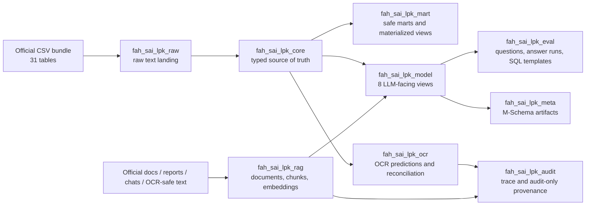
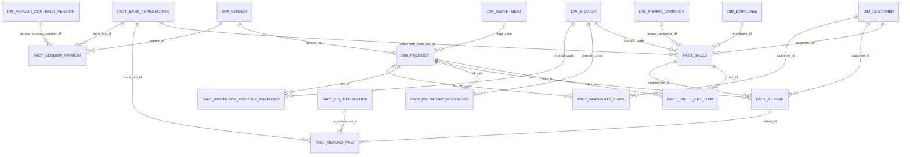
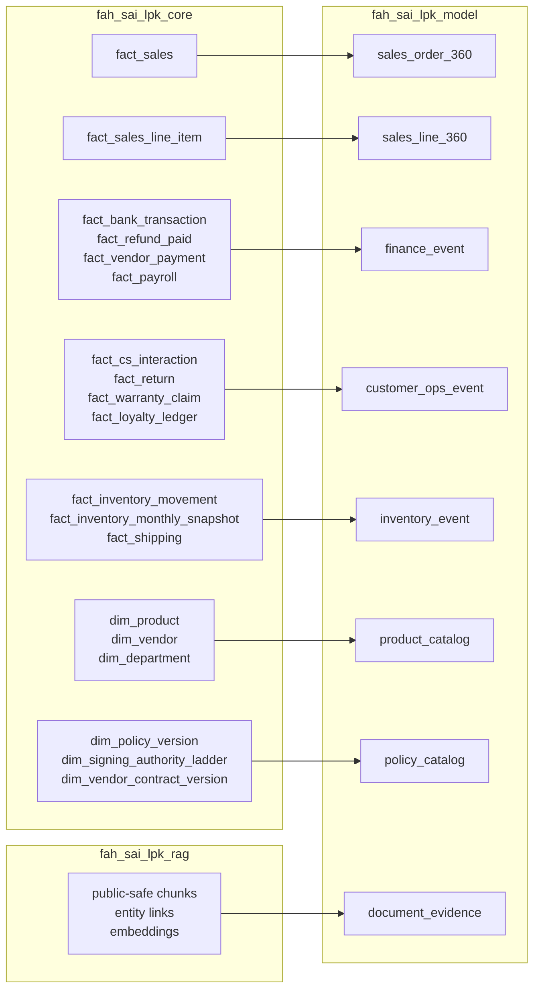
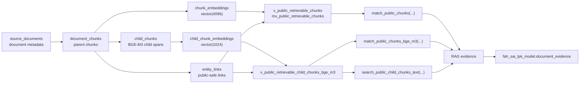
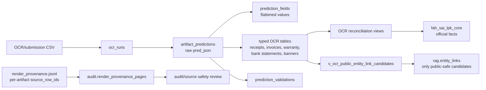

# FahMai Database และ Database Schema Overview

เอกสารนี้สรุปภาพรวมฐานข้อมูลของโปรเจกต์ FahMai Hackathon โดยอ้างอิงจาก migration และไฟล์ข้อมูลจริงใน repository นี้ เป้าหมายคือให้ทีม Data, Model/RAG, Backend หรือผู้ที่เพิ่งเข้ามาอ่าน repo เข้าใจว่า PostgreSQL ถูกแบ่ง schema อย่างไร ตารางไหนเป็น source of truth และควร query ชั้นไหนในแต่ละ use case

## สรุปสั้น

- ฐานข้อมูลหลักคือ PostgreSQL พร้อม extension `pgvector`, `pgcrypto`, และ `pg_trgm`
- official structured data มาจาก CSV จำนวน 31 ตารางใน `super-ai-engineer-season-6-fah-mai-the-finale/tables`
- migration หลักอยู่ใน `db/` โดยใช้ `scripts/apply_db_migrations.py` เป็น runner
- source of truth สำหรับข้อมูลธุรกิจคือ `fah_sai_lpk_core`
- `fah_sai_lpk_raw` เป็น landing layer ที่ทุก column เป็น `text`
- `fah_sai_lpk_rag` เก็บ document/chunk/embedding/entity link สำหรับ retrieval
- `fah_sai_lpk_model` เป็น schema ที่ควร expose ให้ Text-to-SQL/LLM ใช้เป็น default เพราะมีเพียง 8 views ที่ compact และลดความเสี่ยง join ผิด grain
- `fah_sai_lpk_mart` เป็น marts/materialized views สำหรับ query ที่ join แล้วและคุม grain ชัดเจน
- `fah_sai_lpk_ocr`, `fah_sai_lpk_eval`, `fah_sai_lpk_audit`, และ `fah_sai_lpk_meta` เป็น schema สนับสนุนสำหรับ OCR, evaluation, audit/provenance, และ M-Schema handoff

## Database Architecture



ภาพประกอบเพิ่มเติมที่มีใน repo:

- `adviser_assets/fahmai_database_architecture.png`
- `derived/schema_diagrams/fahmai_public_schema.png`
- `derived/schema_diagrams/fahmai_model_schema.png`

## Database Diagrams

### Core Business ERD แบบย่อ

Diagram นี้แสดง relationship สำคัญใน `fah_sai_lpk_core` โดยเน้น grain หลักของ sales, finance, vendor, inventory, returns, refund และ warranty



### Model-Facing Surface

`fah_sai_lpk_model` เป็น compact schema สำหรับ LLM/Text-to-SQL โดยรับข้อมูลจาก `core` และ `rag` แล้ว expose เป็น 8 views



### RAG Retrieval Diagram

RAG มีทั้ง legacy Qwen 4096-dim path และ BGE-M3 parent-child 1024-dim path โดยทุก path ต้องผ่าน public-safe filtering ก่อนนำไปใช้เป็น evidence



### OCR และ Audit Flow

OCR prediction แยกจาก official facts ชัดเจน แล้วใช้ reconciliation views เพื่อตรวจเทียบกับ `core`; provenance ที่เป็น audit-only ไม่ควรถูก cite เป็น final evidence



## Schema Layers

| Schema | บทบาท | ใช้เมื่อไหร่ | ตัวอย่าง object |
|---|---|---|---|
| `fah_sai_lpk_raw` | Landing layer จาก official CSV ทุก field เป็น `text` | ใช้ตรวจ source/raw ingestion หรือ debug casting | `raw.fact_sales`, `raw.dim_product` |
| `fah_sai_lpk_core` | Typed official source of truth | ใช้ query ข้อมูลจริงเชิงธุรกิจและเป็นฐานของ mart/model | `core.fact_sales`, `core.fact_bank_transaction`, `core.dim_customer` |
| `fah_sai_lpk_rag` | Retrieval layer สำหรับ document/chunk/embedding/entity link | ใช้ semantic search, full-text search, public-safe evidence | `rag.source_documents`, `rag.document_chunks`, `rag.child_chunks` |
| `fah_sai_lpk_mart` | Query/mart layer ที่คุม grain และลด repeated join | ใช้ analytics หรือ query ที่ต้องการ performance/ความปลอดภัยของ grain | `mart.v_sales_order`, `mart.mv_vendor_payment` |
| `fah_sai_lpk_model` | Compact LLM-facing schema | ใช้เป็น default schema สำหรับ Text-to-SQL/RAG agent | `model.sales_order_360`, `model.finance_event` |
| `fah_sai_lpk_eval` | Evaluation workflow | เก็บ questions, answer runs, SQL templates, source authority rules | `eval.questions`, `eval.answer_runs` |
| `fah_sai_lpk_ocr` | OCR prediction schema | เก็บ output จาก OCR/submission และ reconcile กับ core | `ocr.artifact_predictions`, `ocr.ocr_receipts` |
| `fah_sai_lpk_audit` | Audit/provenance/trace | เก็บ ingestion/retrieval trace และ provenance ที่ไม่ควรใช้เป็น final evidence | `audit.retrieval_traces`, `audit.render_provenance_pages` |
| `fah_sai_lpk_meta` | Metadata handoff | เก็บ generated M-Schema prompt artifacts | `meta.mschema_artifacts` |

## Migration Map

| Migration | หน้าที่ |
|---|---|
| `db/001_init_fahmai_model_schema.sql` | สร้าง base schemas: `raw`, `core`, `rag`, `mart`, `audit`; สร้าง official raw/core tables, RAG base tables, audit tables, และ mart views ชุดแรก |
| `db/002_eval_retrieval_workflow.sql` | เพิ่ม `fah_sai_lpk_eval`, question/answer tracking, SQL template registry, source authority rules |
| `db/003_performance_indexes.sql` | เพิ่ม performance indexes สำหรับ core/RAG และ audit analyze helper |
| `db/004_materialized_marts.sql` | เปลี่ยน mart views หลักเป็น materialized views พร้อม compatibility views |
| `db/005_rag_hnsw_and_public_chunks_mv.sql` | เพิ่ม public retrievable chunks materialized view และ vector retrieval function สำหรับ legacy 4096-dim embeddings |
| `db/007_fact_date_convention.sql` | ใส่ comments อธิบาย date convention ของ fact tables |
| `db/008_model_facing_schema.sql` | สร้าง `fah_sai_lpk_model` จำนวน 8 views สำหรับ LLM/Text-to-SQL |
| `db/009_ocr_artifact_schema.sql` | สร้าง `fah_sai_lpk_ocr` และ audit provenance สำหรับ OCR artifacts |
| `db/010_rag_bge_m3_parent_child.sql` | เพิ่ม BGE-M3 parent-child retrieval schema: child chunks และ 1024-dim embeddings |
| `db/011_rag_bge_m3_hnsw.sql` | เพิ่ม HNSW vector index สำหรับ BGE-M3 child embeddings |
| `db/012_rag_bge_m3_compact_child_spans.sql` | ปรับ child chunk retrieval ให้ space-aware โดย hydrate text จาก parent spans |
| `db/013_model_schema_prompt_hygiene.sql` | เพิ่ม prompt hygiene comments สำหรับ model-facing schema |
| `db/014_mschema_artifacts.sql` | เพิ่ม `fah_sai_lpk_meta` เพื่อเก็บ M-Schema artifacts |

Preset ที่ใช้บ่อย:

```powershell
python scripts/apply_db_migrations.py --migrations schema --verify
python scripts/apply_db_migrations.py --migrations full --verify
```

`schema` preset ใช้ migrations `001,002,007,008,009,010,012,013,014`

`full` preset รวม performance/mart/RAG index เพิ่มเติม และ apply `011` ท้ายสุด

## Official Source Tables

official CSV มีทั้งหมด 31 ตาราง แบ่งเป็น 16 dimension/lookup tables, 14 fact tables, และ 1 document inventory table

### Dimension และ Lookup Tables

| CSV | Core table | Rows | Grain / ความหมาย |
|---|---:|---:|---|
| `DIM_BANK_ACCOUNT.csv` | `core.dim_bank_account` | 14 | 1 row ต่อ bank account |
| `DIM_BRANCH.csv` | `core.dim_branch` | 11 | 1 row ต่อสาขา/ช่องทาง |
| `dim_care_plus_sku_tier.csv` | `core.dim_care_plus_sku_tier` | 2 | 1 row ต่อ policy/SKU tier |
| `DIM_CUSTOMER.csv` | `core.dim_customer` | 30,000 | 1 row ต่อลูกค้า |
| `DIM_DATE.csv` | `core.dim_date` | 731 | 1 row ต่อ calendar date |
| `DIM_DEPARTMENT.csv` | `core.dim_department` | 9 | 1 row ต่อ department |
| `DIM_EMPLOYEE.csv` | `core.dim_employee` | 600 | 1 row ต่อ employee |
| `DIM_POLICY_VERSION.csv` | `core.dim_policy_version` | 12 | 1 row ต่อ policy version/effective range |
| `DIM_POSITION_LEVEL.csv` | `core.dim_position_level` | 6 | 1 row ต่อ position level |
| `DIM_PRODUCT.csv` | `core.dim_product` | 110 | 1 row ต่อ SKU |
| `dim_product_recall_history.csv` | `core.dim_product_recall_history` | 3 | 1 row ต่อ recall status transition |
| `DIM_PROMO_CAMPAIGN.csv` | `core.dim_promo_campaign` | 7 | 1 row ต่อ promotion campaign |
| `dim_promo_mechanic.csv` | `core.dim_promo_mechanic` | 8 | 1 row ต่อ promotion mechanic |
| `dim_signing_authority_ladder.csv` | `core.dim_signing_authority_ladder` | 7 | 1 row ต่อ signing authority rule |
| `DIM_VENDOR.csv` | `core.dim_vendor` | 6 | 1 row ต่อ vendor |
| `DIM_VENDOR_CONTRACT_VERSION.csv` | `core.dim_vendor_contract_version` | 22 | 1 row ต่อ vendor contract version/effective range |

### Fact Tables

| CSV | Core table | Rows | Grain / ความหมาย |
|---|---:|---:|---|
| `FACT_BANK_TRANSACTION.csv` | `core.fact_bank_transaction` | 65,334 | 1 row ต่อ bank transaction |
| `FACT_CS_INTERACTION.csv` | `core.fact_cs_interaction` | 14,368 | 1 row ต่อ customer service interaction |
| `FACT_INVENTORY_MONTHLY_SNAPSHOT.csv` | `core.fact_inventory_monthly_snapshot` | 26,220 | 1 row ต่อ SKU/branch/month snapshot |
| `FACT_INVENTORY_MOVEMENT.csv` | `core.fact_inventory_movement` | 310,827 | 1 row ต่อ inventory movement event |
| `FACT_LOYALTY_LEDGER.csv` | `core.fact_loyalty_ledger` | 118,857 | 1 row ต่อ loyalty ledger event |
| `FACT_PAYROLL.csv` | `core.fact_payroll` | 14,400 | 1 row ต่อ employee payroll period |
| `FACT_PROMO_REDEMPTION.csv` | `core.fact_promo_redemption` | 1,583 | 1 row ต่อ promo redemption |
| `FACT_REFUND_PAID.csv` | `core.fact_refund_paid` | 7,134 | 1 row ต่อ refund payment |
| `FACT_RETURN.csv` | `core.fact_return` | 7,144 | 1 row ต่อ return event |
| `FACT_SALES.csv` | `core.fact_sales` | 117,105 | 1 row ต่อ sales transaction/order |
| `FACT_SALES_LINE_ITEM.csv` | `core.fact_sales_line_item` | 309,129 | 1 row ต่อ sales line item |
| `FACT_SHIPPING.csv` | `core.fact_shipping` | 23,182 | 1 row ต่อ shipment |
| `FACT_VENDOR_PAYMENT.csv` | `core.fact_vendor_payment` | 809 | 1 row ต่อ vendor payment |
| `FACT_WARRANTY_CLAIM.csv` | `core.fact_warranty_claim` | 3,973 | 1 row ต่อ warranty claim |

### Document Inventory

| CSV | Core table | Rows | Grain / ความหมาย |
|---|---:|---:|---|
| `T2_DOC_INVENTORY.csv` | `core.t2_doc_inventory` | 81 | 1 row ต่อ official document inventory record |

หมายเหตุสำคัญ: `FACT_SALES_DEPOSIT_BATCH` ไม่ใช่ official table ใน bundle นี้ และไม่ถูกสร้างเป็น `core.fact_sales_deposit_batch` ให้ใช้ `fah_sai_lpk_mart.v_sales_deposit_batch_reconciliation` เฉพาะงาน QA/reconciliation และ cite final answer ด้วย source จริงคือ `FACT_SALES` และ `FACT_BANK_TRANSACTION`

## Core Schema Design

`fah_sai_lpk_core` คือชั้นข้อมูล typed และเป็น source of truth สำหรับ structured data:

- ID-like fields ใช้ `text` เพื่อกันปัญหา ID ยาวหรือ ID ที่มี prefix ถูก cast ผิด
- monetary fields ใช้ `numeric(18,2)`
- date fields ใช้ `date`
- timestamp fields ใช้ `timestamptz`
- metadata และ flexible payload ใช้ `jsonb`
- polymorphic linkage เช่น `related_entity_table`, `related_entity_id`, `source_table`, `source_pk` ไม่บังคับเป็น FK ตรง เพราะต้อง route ตาม discriminator

### Fact Date Convention

fact tables ใช้ date columns แนว bitemporal-lite:

| Column | ใช้เมื่อไหร่ |
|---|---|
| `business_event_date` | default สำหรับคำถามที่ถามช่วงเวลา เช่น ปี เดือน ไตรมาส โดยไม่ได้ระบุ date column |
| `posting_date` | ใช้เมื่อโจทย์ถามเรื่อง posted/booked/accounting timing โดยเฉพาะ |
| `effective_date` | ใช้เป็น metadata/effective timing ไม่ใช่ default period filter |
| `as_of_date` | ใช้เป็น bundle/snapshot metadata ไม่ใช่ event period |

ตัวอย่าง: ถ้าโจทย์ถาม "ปี 2568" ให้ filter เป็น `business_event_date >= DATE '2025-01-01' AND business_event_date < DATE '2026-01-01'`

## Business Domain Map

| Domain | ตารางหลัก | Notes |
|---|---|---|
| Sales order | `fact_sales`, `fact_sales_line_item`, `dim_customer`, `dim_branch`, `dim_employee`, `dim_promo_campaign` | ระวัง grain: order-level ใช้ `fact_sales`, line-level ใช้ `fact_sales_line_item` |
| Product/catalog | `dim_product`, `dim_vendor`, `dim_department`, `dim_product_recall_history` | ใช้ตอบ SKU, brand, category, vendor, lifecycle |
| Finance/bank | `fact_bank_transaction`, `dim_bank_account`, `fact_vendor_payment`, `fact_refund_paid`, `fact_payroll` | `fact_bank_transaction.related_entity_table` เป็น polymorphic route ไป entity อื่น |
| Vendor/contract | `dim_vendor`, `dim_vendor_contract_version`, `fact_vendor_payment` | resolve contract ตาม `business_event_date` เมื่อโจทย์ถาม temporal logic |
| Inventory/shipping | `fact_inventory_movement`, `fact_inventory_monthly_snapshot`, `fact_shipping`, `dim_branch`, `dim_product` | movement เป็น event grain, snapshot เป็น month grain |
| Customer service/returns/warranty | `fact_cs_interaction`, `fact_return`, `fact_refund_paid`, `fact_warranty_claim` | ใช้เชื่อมเคสบริการ, การคืนสินค้า, refund และ warranty |
| Policy/control | `dim_policy_version`, `dim_signing_authority_ladder`, `dim_position_level`, `dim_employee` | policy ต้อง resolve ด้วย effective date/end date |
| Documents/RAG | `t2_doc_inventory`, `rag.source_documents`, `rag.document_chunks`, `rag.entity_links` | ใช้ cite narrative/policy/chat/report evidence |

## Mart Schema

`fah_sai_lpk_mart` เป็น query layer ที่ช่วยลดความเสี่ยงจากการ join fact-to-fact ผิด grain และช่วย performance ผ่าน materialized views

| Mart view | Grain | ใช้สำหรับ |
|---|---|---|
| `mart.v_sales_order` | 1 row ต่อ `fact_sales.txn_id` | order-level sales analytics |
| `mart.v_sales_line` | 1 row ต่อ `fact_sales_line_item.line_item_id` | SKU/product/line item analytics |
| `mart.v_bank_reconciliation` | 1 row ต่อ `fact_bank_transaction.bank_txn_id` | bank settlement/reconciliation |
| `mart.v_vendor_payment` | 1 row ต่อ `fact_vendor_payment.payment_id` | vendor payment พร้อม vendor/contract/bank context |
| `mart.v_sales_deposit_batch_reconciliation` | 1 row ต่อ reconstructed deposit batch | QA/reconciliation เท่านั้น ไม่ใช่ official source |

หลัง ingest data และสร้าง materialized marts แล้ว refresh ด้วย:

```sql
SELECT fah_sai_lpk_mart.refresh_all_materialized_views(false);
```

ถ้า materialized views เคย populate แล้วและต้องการ refresh แบบ concurrent:

```sql
SELECT fah_sai_lpk_mart.refresh_all_materialized_views(true);
```

## Model-Facing Schema

`fah_sai_lpk_model` คือ schema ที่ออกแบบให้ LLM/Text-to-SQL ใช้เป็น default เพื่อให้ surface เล็กลงและลดโอกาส query ผิด:

| View | Source หลัก | ใช้สำหรับ |
|---|---|---|
| `model.sales_order_360` | `FACT_SALES` + dimensions | order, customer, branch, payment, B2B sales |
| `model.sales_line_360` | `FACT_SALES_LINE_ITEM` + sales/product/vendor | product mix, SKU, quantity, discount, line totals |
| `model.finance_event` | bank/refund/vendor payment/payroll/loyalty | cashflow, bank movement, refund/vendor/payroll finance events |
| `model.customer_ops_event` | CS/return/refund/warranty/loyalty | customer operations and after-sales events |
| `model.inventory_event` | inventory movement/snapshot/shipping | stock, movement, shipment, inventory period analysis |
| `model.product_catalog` | product/vendor/department/recall/care-plus | product metadata and catalog lookup |
| `model.policy_catalog` | policy/signing authority/vendor contracts | policy and contract lookup by effective dates |
| `model.document_evidence` | public-safe RAG chunks | document/chat/report/policy evidence for RAG |

Default rule: ถ้าเป็น agent ที่สร้าง SQL ให้เริ่มจาก `fah_sai_lpk_model` ก่อน เว้นแต่ต้อง debug source data หรือจำเป็นต้องใช้ column ที่ไม่ได้ expose

## RAG Schema

`fah_sai_lpk_rag` แยกเป็น 2 generation:

### Legacy / Qwen 4096-dim Retrieval

| Object | หน้าที่ |
|---|---|
| `rag.source_documents` | metadata ของเอกสาร/ไฟล์/ข้อความ |
| `rag.document_chunks` | parent text chunks พร้อม `search_tsv` |
| `rag.chunk_embeddings` | embeddings แบบ `vector(4096)` |
| `rag.entity_links` | public-safe entity links จากเอกสาร/chunk กลับไปหา official tables |
| `rag.v_public_retrievable_chunks` | view สำหรับ public-safe chunks |
| `rag.mv_public_retrievable_chunks` | materialized view สำหรับลด repeated joins |
| `rag.match_public_chunks(...)` | vector retrieval function |

### BGE-M3 Parent-Child Retrieval

| Object | หน้าที่ |
|---|---|
| `rag.child_chunks` | child chunks ที่ผูกกับ parent `document_chunks` |
| `rag.child_chunk_embeddings` | BGE-M3 embeddings แบบ `vector(1024)` |
| `rag.v_public_retrievable_child_chunks_bge_m3` | public-safe child chunks พร้อม hydrated parent context |
| `rag.match_public_chunks_bge_m3(...)` | vector retrieval สำหรับ BGE-M3 |
| `rag.search_public_child_chunks_text(...)` | full-text retrieval สำหรับ child chunks |

Public-safe rule:

- ใช้ได้เฉพาะ documents/chunks/entity links ที่ `is_public_safe = true`
- audit-only provenance เช่น `source_row_ids` จาก render sidecar ไม่ควรใช้เป็น final-answer evidence
- final answer ควร cite official table/file หรือ public-safe document ไม่ใช่ helper/provenance shortcut

## OCR Schema

`fah_sai_lpk_ocr` เก็บ prediction และ typed extraction จาก OCR/submission โดยแยกจาก official core facts อย่างชัดเจน

| Object | หน้าที่ |
|---|---|
| `ocr.ocr_runs` | 1 row ต่อ OCR run |
| `ocr.artifact_predictions` | raw prediction ต่อ artifact |
| `ocr.prediction_fields` | flattened field/value index จาก prediction JSON |
| `ocr.ocr_receipts` | typed receipt extraction |
| `ocr.ocr_receipt_line_items` | receipt line items |
| `ocr.ocr_vendor_invoices` | vendor invoice extraction |
| `ocr.ocr_warranty_claims` | warranty claim extraction |
| `ocr.ocr_bank_statement_headers` | bank statement header extraction |
| `ocr.ocr_bank_statement_transactions` | bank statement transaction extraction |
| `ocr.ocr_e7_banners` | promo/banner extraction |
| `ocr.ocr_t3_entity_snapshots` | entity snapshot extraction |
| `ocr.prediction_validations` | validation result ต่อ prediction |

Reconciliation views:

- `ocr.v_ocr_receipt_reconciliation`
- `ocr.v_ocr_vendor_invoice_reconciliation`
- `ocr.v_ocr_warranty_reconciliation`
- `ocr.v_ocr_bank_transaction_reconciliation`
- `ocr.v_ocr_public_entity_link_candidates`

สำคัญ: OCR schema ไม่ใช่ official business fact source ให้ใช้เพื่อ validate, reconcile, หรือสร้าง public-safe entity link เท่านั้น ถ้าจะตอบคำถาม final ให้กลับไป cite `core` หรือ official documents

## Eval, Audit, และ Meta

### `fah_sai_lpk_eval`

ใช้เก็บ workflow การตอบคำถามและวัดผล:

- `eval.questions`: question bank จาก `questions.csv`
- `eval.question_tags`: tags/families ของคำถาม
- `eval.answer_runs`: run output, SQL, sources, traces, token count
- `eval.sql_templates`: reusable SQL patterns
- `eval.source_authority_rules`: rule ว่า source ไหนใช้เป็น final evidence ได้หรือไม่ได้

### `fah_sai_lpk_audit`

ใช้เก็บ trace และ provenance ที่ควรแยกจาก evidence หลัก:

- `audit.ingestion_runs`
- `audit.source_safety_flags`
- `audit.provenance_entity_links`
- `audit.retrieval_traces`
- `audit.render_provenance_pages`

### `fah_sai_lpk_meta`

ใช้เก็บ generated M-Schema artifacts:

- `meta.mschema_artifacts`
- `meta.v_current_mschema_artifacts`

schema นี้ตั้งใจแยกออกจาก `fah_sai_lpk_model` เพื่อให้ LLM-facing schema ยังคงมี 8 views เท่านั้น

## Indexing และ Performance

แนวทาง index ที่ใช้ใน migration:

- B-tree index สำหรับ lookup/filter ทั่วไป เช่น IDs, dates, `(vendor_id, business_event_date)`
- composite indexes สำหรับ query pattern ที่มี equality + range เช่น branch/date, customer/date
- partial index สำหรับเคสเฉพาะ เช่น B2B open AR
- GIN index สำหรับ `jsonb`, `search_tsv`, และ text trigram search
- HNSW index สำหรับ vector search ด้วย `pgvector`
- materialized views สำหรับ marts และ public retrievable chunks เพื่อลด repeated joins

Extension ที่ใช้:

```sql
CREATE EXTENSION IF NOT EXISTS vector;
CREATE EXTENSION IF NOT EXISTS pgcrypto;
CREATE EXTENSION IF NOT EXISTS pg_trgm;
```

## Query Rules ที่ควรยึด

1. สำหรับ final answer จาก structured data ให้ใช้ `fah_sai_lpk_core` หรือ `fah_sai_lpk_model`
2. สำหรับ Text-to-SQL/agent default ให้ใช้ `fah_sai_lpk_model`
3. อย่า aggregate จาก fact ที่ถูก join ลง grain ที่ละเอียดกว่าโดยไม่ aggregate ฝั่งลูกก่อน
4. ถ้าคำถามระดับ order ให้ใช้ `sales_order_360` หรือ `mart.v_sales_order`
5. ถ้าคำถามระดับ line item/SKU ให้ใช้ `sales_line_360` หรือ `mart.v_sales_line`
6. ถ้าคำถามเกี่ยวกับ bank settlement ให้ดู `finance_event`, `core.fact_bank_transaction`, หรือ `mart.v_bank_reconciliation`
7. ถ้าคำถามถามช่วงเวลาโดยไม่ระบุ date column ให้ใช้ `business_event_date`
8. ใช้ `posting_date` เฉพาะเมื่อโจทย์ถาม posting/booked/accounting date ชัดเจน
9. ถ้าต้อง resolve policy/contract ให้ใช้ `effective_date <= business_event_date` และ `end_date IS NULL OR end_date >= business_event_date`
10. อย่า cite derived helper, virtual reconciliation view, หรือ audit-only provenance เป็น official source

## Load และ Rebuild Flow

สร้าง schema:

```powershell
python -m pip install -r requirements.txt
python scripts/apply_db_migrations.py --migrations schema --verify
```

โหลด official tables:

```powershell
python scripts/ingest_fahmai_to_postgres.py --truncate --skip-rag
```

โหลด RAG documents/entity links และ build BGE-M3 chunks:

```powershell
python scripts/ingest_rag_batches.py --commit-docs 500 --load-entity-links
python scripts/build_bge_parent_child_chunks.py --profile bge_m3_v1 --replace-profile --json
python scripts/embed_chunks_openai.py --retrieval-profile bge_m3_v1 --provider tei --endpoint http://localhost:8080/embed --batch-size 64 --refresh-materialized
```

เพิ่ม BGE-M3 HNSW index และ upload M-Schema:

```powershell
python scripts/apply_db_migrations.py --migrations "011" --verify
python scripts/generate_fahmai_mschema.py --schema-mode model --strict-live
python scripts/upload_mschema_artifacts.py --retrieval-profile bge_m3_v1 --json
```

Smoke test:

```powershell
python scripts/run_question.py --retrieval-profile bge_m3_v1 --question-id FAHMAI-Q-L1-001 --run-label production-smoke-bge
```

## Verification SQL

```sql
SELECT to_regclass('fah_sai_lpk_core.fact_sales');
SELECT to_regclass('fah_sai_lpk_rag.child_chunks');
SELECT to_regclass('fah_sai_lpk_rag.child_chunk_embeddings');
SELECT to_regclass('fah_sai_lpk_eval.questions');
SELECT to_regclass('fah_sai_lpk_model.sales_order_360');
SELECT to_regclass('fah_sai_lpk_model.document_evidence');
SELECT to_regclass('fah_sai_lpk_meta.mschema_artifacts');

SELECT count(*) AS model_surface_count
FROM information_schema.views
WHERE table_schema = 'fah_sai_lpk_model';

SELECT count(*) AS bad_bge_embedding_dims
FROM fah_sai_lpk_rag.child_chunk_embeddings
WHERE retrieval_profile = 'bge_m3_v1'
  AND vector_dims(embedding) <> 1024;

SELECT extname, extversion
FROM pg_extension
WHERE extname IN ('vector', 'pgcrypto', 'pg_trgm');
```

Expected:

- `model_surface_count` ควรเป็น `8`
- BGE-M3 embedding dimension check ควรได้ `0`
- official CSV load ควรครบ 31 tables

## Reference Files

- `db/001_init_fahmai_model_schema.sql`
- `db/002_eval_retrieval_workflow.sql`
- `db/004_materialized_marts.sql`
- `db/008_model_facing_schema.sql`
- `db/009_ocr_artifact_schema.sql`
- `db/010_rag_bge_m3_parent_child.sql`
- `db/014_mschema_artifacts.sql`
- `docs/remote_table_creation.md`
- `fahmai_model_database_schema.md`
- `fahmai_model_erd.mmd`
- `fahmai_table_schema.md`
- `derived/README.md`
