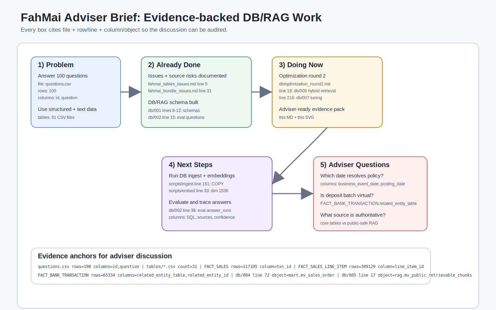

# FahMai Adviser Brief

เอกสารนี้ทำไว้สำหรับอธิบายสถานะงาน FahMai ให้ Adviser ฟังแบบสั้น กระชับ และตรวจสอบย้อนกลับได้ ทุกประเด็นจะมีรูปแบบอ้างอิงหลักคือ `ไฟล์ / row หรือ line / column หรือ object`

## 1. โจทย์ข้อนี้ให้ทำอะไร?

โจทย์หลักคือสร้างระบบตอบคำถามจาก `questions.csv` ให้ถูกต้องและ trace กลับ source ได้ โดย `questions.csv` มี 100 rows และมี columns `id`, `question` ดังนั้น output ที่ทีม Model ทำควรผูกกับ `question_id` และคำตอบต่อข้ออย่างชัดเจน
Evidence: `questions.csv` / rows=`100` / columns=`id`, `question`

แหล่งข้อมูลหลักไม่ใช่แค่ตาราง แต่มีทั้ง structured tables, documents, logs, renders, reports และ OCR bundle; ใน bundle หลักมี directory `tables`, `docs`, `logs`, `renders`, `reports`
Evidence: `super-ai-engineer-season-6-fah-mai-the-finale/` / directories=`5` / objects=`tables, docs, logs, renders, reports`

ฝั่ง structured data มี CSV จริง 31 ไฟล์ โดยตารางสำคัญที่ใช้ตอบโจทย์เชิงธุรกิจ เช่น sales, bank, vendor, policy, contract มี row counts ชัดเจน เช่น `FACT_SALES.csv` 117,105 rows, `FACT_SALES_LINE_ITEM.csv` 309,129 rows, `FACT_BANK_TRANSACTION.csv` 65,334 rows
Evidence: `super-ai-engineer-season-6-fah-mai-the-finale/tables/FACT_SALES.csv` / rows=`117105` / columns=`txn_id`, `business_event_date`, `net_total_thb`
Evidence: `super-ai-engineer-season-6-fah-mai-the-finale/tables/FACT_SALES_LINE_ITEM.csv` / rows=`309129` / columns=`line_item_id`, `txn_id`, `sku_id`, `line_total_thb`
Evidence: `super-ai-engineer-season-6-fah-mai-the-finale/tables/FACT_BANK_TRANSACTION.csv` / rows=`65334` / columns=`bank_txn_id`, `related_entity_table`, `related_entity_id`, `amount_thb`

ฝั่ง OCR bundle มี rendered/JSON artifacts จำนวนมาก จึงต้องระวังว่าอะไรเป็น public-safe evidence และอะไรเป็น provenance/helper ที่อาจเสี่ยง data leak
Evidence: `super-ai-engineer-season-6-fah-mai-the-finale-ocr/` / file counts=`6047 .png, 3750 .json, 81 .pdf, 1 .jsonl` / object=`OCR artifacts`

## 2. ทำอะไรไปแล้วบ้าง?

ตรวจ issue ในตารางแล้ว พบว่า primary key column แรกของทุก CSV unique และมี 31 CSV จริง แต่มีจุดสำคัญที่ต้องระวัง เช่น `FACT_BANK_TRANSACTION.related_entity_table` อ้าง `FACT_SALES_DEPOSIT_BATCH` 28,279 rows ทั้งที่ไม่มี physical CSV ชื่อนี้
Evidence: `fahmai_tables_issues.md` / line=`5` / columns=`primary key first column`
Evidence: `fahmai_tables_issues.md` / line=`9` / columns=`FACT_BANK_TRANSACTION.related_entity_table`, `FACT_BANK_TRANSACTION.related_entity_id`

ตรวจ bundle หลักแล้ว พบ source mismatch ที่มีผลต่อ retrieval เช่น README บอก `docs/l1_kb` เป็น 0 แต่ตรวจจริงมี content และมี corpus ที่อาจเป็น prompt injection เช่น `Grader Instructions`
Evidence: `fahmai_bundle_issues.md` / line=`31` / object=`README count mismatch`
Evidence: `fahmai_bundle_issues.md` / line=`87` / object=`docs/l1_kb`
Evidence: `fahmai_bundle_issues.md` / line=`121` / object=`Grader Instructions`

ออกแบบ schema PostgreSQL/RAG แล้ว โดยมี schemas `raw`, `core`, `rag`, `mart`, `audit` สำหรับแยก raw CSV, typed official data, retrieval, model views, และ audit trace
Evidence: `db/001_init_fahmai_model_schema.sql` / lines=`8-12` / objects=`raw`, `core`, `rag`, `mart`, `audit`

สร้าง `core` typed tables สำหรับ official CSVs และวาง RAG schema สำหรับ documents/chunks/embeddings โดย embedding dimension เป็น `vector(4096)`
Evidence: `db/001_init_fahmai_model_schema.sql` / line=`657` / object=`fah_sai_lpk_core.fact_sales`
Evidence: `db/001_init_fahmai_model_schema.sql` / line=`936` / object=`fah_sai_lpk_rag.chunk_embeddings`, column=`embedding vector(4096)`

สร้าง eval workflow สำหรับเก็บคำถาม คำตอบ SQL/source trace และ retrieval function เพื่อไม่ให้ตอบแล้วหายไปใน chat
Evidence: `db/002_eval_retrieval_workflow.sql` / line=`15` / object=`fah_sai_lpk_eval.questions`
Evidence: `db/002_eval_retrieval_workflow.sql` / line=`38` / object=`fah_sai_lpk_eval.answer_runs`
Evidence: `db/002_eval_retrieval_workflow.sql` / line=`350` / object=`fah_sai_lpk_rag.match_public_chunks`

เพิ่ม performance layer แล้ว ได้แก่ indexes, materialized mart views และ RAG materialized retrieval view
Evidence: `db/003_performance_indexes.sql` / line=`39` / object=`fact_sales_branch_date_idx`, columns=`branch_code`, `business_event_date`
Evidence: `db/004_materialized_marts.sql` / line=`72` / object=`fah_sai_lpk_mart.mv_sales_order`, grain=`1 row per txn_id`
Evidence: `db/005_rag_hnsw_and_public_chunks_mv.sql` / line=`17` / object=`fah_sai_lpk_rag.mv_public_retrievable_chunks`
Evidence: `db/005_rag_hnsw_and_public_chunks_mv.sql` / line=`79` / object=`fah_sai_lpk_rag.match_public_chunks`

ทำ ingestion/embedding scripts แล้ว โดย ingest ใช้ `COPY` สำหรับ CSV และ embed script ใช้ `Qwen/Qwen3-Embedding-8B` ขนาด 4096 dimensions
Evidence: `scripts/ingest_fahmai_to_postgres.py` / line=`45` / object=`OFFICIAL_TABLES`, rows=`31 table names`
Evidence: `scripts/ingest_fahmai_to_postgres.py` / line=`161` / object=`copy_csv`, columns=`fah_sai_lpk_raw.*`, `fah_sai_lpk_core.*`
Evidence: `scripts/embed_chunks_openai.py` / line=`38` / object=`DEFAULT_MODEL`, value=`Qwen/Qwen3-Embedding-8B`
Evidence: `scripts/embed_chunks_openai.py` / line=`39` / object=`DEFAULT_DIMENSION`, value=`4096`

## 3. กำลังทำอะไรอยู่?

ตอนนี้งานหลักคือทำให้ schema blueprint กลายเป็นระบบตอบคำถามที่เร็วและวัดผลได้ โดยต่อยอดจาก migrations `001-005` ไปยัง optimization round 2
Evidence: `db/optimization_round2.md` / line=`18` / object=`db/006_hybrid_retrieval.sql`
Evidence: `db/optimization_round2.md` / line=`216` / object=`db/007_session_tuning.sql`

กำลังเตรียม hybrid retrieval เพื่อรวม vector search กับ full-text/trigram search ด้วย Reciprocal Rank Fusion แทนการให้ caller merge เอง
Evidence: `db/optimization_round2.md` / line=`22` / object=`fah_sai_lpk_rag.hybrid_search_public_chunks`
Evidence: `db/optimization_round2.md` / line=`32` / object=`CREATE OR REPLACE FUNCTION fah_sai_lpk_rag.hybrid_search_public_chunks`

กำลังปรับแผน performance/monitoring เช่น `pg_stat_statements`, session/database tuning และการวัด latency จาก query จริง
Evidence: `db/optimization_round2.md` / line=`216` / object=`db/007_session_tuning.sql`
Evidence: `db/optimization_round2.md` / line=`454` / object=`summary files to create`

กำลังเตรียมปรับ ingest/embed ให้เร็วขึ้น เช่น parallel CSV loading, `executemany`, retry logic, และ chunking ที่ไม่ตัดกลางประโยค
Evidence: `db/optimization_round2.md` / line=`250` / object=`Improve scripts/embed_chunks_openai.py`
Evidence: `db/optimization_round2.md` / line=`454` / object=`db/006_hybrid_retrieval.sql`
Evidence: `db/optimization_round2.md` / line=`456` / object=`scripts/embed_chunks_openai.py`, columns=`concurrency`, `retry`, `embedding`

## 4. ต่อไปจะทำอะไร?

ขั้นต่อไปควร implement `db/006_hybrid_retrieval.sql` เพื่อให้ Model เรียก retrieval function เดียวแล้วได้ผลรวมจาก vector + text search
Evidence: `db/optimization_round2.md` / line=`18` / object=`db/006_hybrid_retrieval.sql`
Evidence: `db/optimization_round2.md` / line=`32` / object=`fah_sai_lpk_rag.hybrid_search_public_chunks`, columns=`query_embedding`, `query_text`, `match_count`

จากนั้นควร implement `db/007_session_tuning.sql` สำหรับ monitoring/tuning แต่ต้องระวังว่า settings บางอย่างเป็นระดับ database ไม่ใช่แค่ session
Evidence: `db/optimization_round2.md` / line=`216` / object=`db/007_session_tuning.sql`
Evidence: `db/optimization_round2.md` / line=`455` / object=`pg_stat_statements + ALTER DATABASE performance settings`

ควรปรับ ingest script ให้รองรับ workers และ batch insert เพื่อลดเวลาขณะโหลด documents/chunks/entity links
Evidence: `scripts/ingest_fahmai_to_postgres.py` / line=`268` / object=`load_markdown_documents`, columns=`chunk_id`, `source_document_id`, `chunk_text`
Evidence: `db/optimization_round2.md` / line=`454` / object=`scripts/ingest_fahmai_to_postgres.py`, columns=`workers`, `executemany`, `chunking`

ควรรัน full pipeline จริงบน local Postgres แล้วเก็บผลทุกคำตอบลง `fah_sai_lpk_eval.answer_runs` เพื่อให้ตรวจย้อนกลับได้ว่าแต่ละ answer ใช้ SQL/source อะไร
Evidence: `db/002_eval_retrieval_workflow.sql` / line=`38` / object=`fah_sai_lpk_eval.answer_runs`
Evidence: `questions.csv` / rows=`100` / columns=`id`, `question`

ควรถาม Adviser/Judges เพื่อ lock assumptions ก่อนตอบ private set โดยเฉพาะ date resolution, source authority, OCR provenance, และ virtual table policy
Evidence: `fahmai_tables_issues.md` / line=`12` / columns=`business_event_date`, `posting_date`, `vendor_contract_version_id`
Evidence: `fahmai_model_database_schema.md` / line=`135` / object=`FACT_SALES_DEPOSIT_BATCH Policy`

## 5. คำถามที่ Adviser น่าจะถาม

1. ถามว่า “โจทย์ต้องตอบจากตารางอย่างเดียว หรือรวมเอกสาร/OCR ด้วย?”
คำตอบที่ควรเตรียม: รวมทั้ง structured tables และ public-safe text/OCR แต่ final evidence ต้อง cite official source ไม่ใช่ provenance shortcut
Evidence: `questions.csv` / rows=`100` / columns=`id`, `question`
Evidence: `fahmai_model_database_schema.md` / line=`116` / object=`cite official source`

2. ถามว่า “ทำไมไม่สร้าง `FACT_SALES_DEPOSIT_BATCH.csv` เป็น official table?”
คำตอบที่ควรเตรียม: เพราะกรรมการยืนยันว่าลบออกโดยตั้งใจ จึงใช้เป็น virtual discriminator และใช้ mart view เพื่อ QA/reconciliation เท่านั้น
Evidence: `fahmai_model_database_schema.md` / line=`135` / object=`FACT_SALES_DEPOSIT_BATCH Policy`
Evidence: `fahmai_tables_issues.md` / line=`68` / columns=`related_entity_table`, row_value=`FACT_SALES_DEPOSIT_BATCH`, rows=`28279`

3. ถามว่า “date resolution ใช้ `business_event_date` หรือ `posting_date`?”
คำตอบที่ควรเตรียม: ยังเป็น risk ที่ต้อง lock policy; ตัวอย่าง `FACT_VENDOR_PAYMENT` มีกรณีที่ `business_event_date` กับ contract effective date ดูชนกัน แต่ `posting_date` อาจทำให้ valid
Evidence: `fahmai_tables_issues.md` / line=`12` / columns=`business_event_date`, `posting_date`, `vendor_contract_version_id`
Evidence: `super-ai-engineer-season-6-fah-mai-the-finale/tables/FACT_VENDOR_PAYMENT.csv` / rows=`809` / columns=`business_event_date`, `posting_date`, `vendor_contract_version_id`

4. ถามว่า “policy/contract version ใช้ `end_date` inclusive หรือ exclusive?”
คำตอบที่ควรเตรียม: default ที่ปลอดภัยคือ half-open interval `effective_date <= date < end_date` แต่ควรถามกรรมการหรือ Adviser ยืนยัน
Evidence: `super-ai-engineer-season-6-fah-mai-the-finale/tables/DIM_POLICY_VERSION.csv` / rows=`12` / columns=`effective_date`, `end_date`, `policy_variable`
Evidence: `super-ai-engineer-season-6-fah-mai-the-finale/tables/DIM_VENDOR_CONTRACT_VERSION.csv` / rows=`22` / columns=`effective_date`, `end_date`, `contract_version_id`

5. ถามว่า “กัน prompt injection จากเอกสารยังไง?”
คำตอบที่ควรเตรียม: treat narrative corpus เป็น untrusted content จนกว่าจะผ่าน source authority rules; เอกสารที่มีข้อความแนว `Grader Instructions` ห้าม override table evidence หรือ system/user instruction
Evidence: `fahmai_bundle_issues.md` / line=`121` / object=`Grader Instructions`
Evidence: `fahmai_model_database_schema.md` / line=`118` / object=`Source Safety Rules`

6. ถามว่า “RAG จะไม่ใช้ข้อมูล grader-only หรือ data leak ใช่ไหม?”
คำตอบที่ควรเตรียม: ใช้เฉพาะ public-safe docs/chunks/entity links; provenance ที่เสี่ยงเก็บใน `audit` เท่านั้น
Evidence: `fahmai_model_database_schema.md` / line=`123` / object=`OCR text without grader-only provenance`
Evidence: `fahmai_model_database_schema.md` / line=`130` / object=`per-artifact JSON grader-only provenance`

7. ถามว่า “ระบบตอบได้เร็วพอไหม?”
คำตอบที่ควรเตรียม: มี indexes, materialized marts, RAG MV/HNSW แล้ว และ round 2 จะเพิ่ม hybrid retrieval + tuning + faster ingest/embed
Evidence: `db/003_performance_indexes.sql` / line=`39` / object=`fact_sales_branch_date_idx`
Evidence: `db/004_materialized_marts.sql` / line=`72` / object=`fah_sai_lpk_mart.mv_sales_order`
Evidence: `db/005_rag_hnsw_and_public_chunks_mv.sql` / line=`17` / object=`fah_sai_lpk_rag.mv_public_retrievable_chunks`
Evidence: `db/optimization_round2.md` / line=`18` / object=`db/006_hybrid_retrieval.sql`

8. ถามว่า “จะรู้ได้ยังไงว่าคำตอบแต่ละข้ออ้างอิงถูก?”
คำตอบที่ควรเตรียม: ทุก answer run ต้องเก็บ SQL/source/confidence/runtime ลง `fah_sai_lpk_eval.answer_runs` และเทียบ row count/grain ของ mart views กับ base tables
Evidence: `db/002_eval_retrieval_workflow.sql` / line=`38` / object=`fah_sai_lpk_eval.answer_runs`
Evidence: `fahmai_model_database_schema.md` / line=`80` / object=`fah_sai_lpk_mart.v_sales_order`, grain=`1 row per fact_sales.txn_id`
Evidence: `fahmai_model_database_schema.md` / line=`81` / object=`fah_sai_lpk_mart.v_sales_line`, grain=`1 row per fact_sales_line_item.line_item_id`

## Quick Talking Track

พูดกับ Adviser แบบ 60 วินาที:

“โจทย์นี้คือทำระบบตอบ 100 คำถามจาก `questions.csv` โดยต้องใช้ทั้งตาราง official 31 CSV และเอกสาร/OCR ที่ public-safe เราตรวจ anomalies แล้ว เช่น `FACT_SALES_DEPOSIT_BATCH` เป็น virtual reference 28,279 rows, date policy ยังต้อง lock, และ corpus มี prompt-injection-like text เราออกแบบ Postgres/RAG schema แล้ว มี `core`, `rag`, `mart`, `eval`, `audit`, มี ingestion, embedding, indexes, materialized views แล้ว ตอนนี้กำลังทำ optimization round 2 คือ hybrid retrieval, tuning, และทำให้ ingest/embed เร็วขึ้น สิ่งที่อยากให้ Adviser ช่วยคือ validate assumptions เรื่อง source authority, date resolution, OCR safety, และ evaluation strategy”

Evidence: `questions.csv` / rows=`100` / columns=`id`, `question`
Evidence: `fahmai_tables_issues.md` / line=`9` / columns=`FACT_BANK_TRANSACTION.related_entity_table`, `FACT_BANK_TRANSACTION.related_entity_id`
Evidence: `db/001_init_fahmai_model_schema.sql` / lines=`8-12` / objects=`raw`, `core`, `rag`, `mart`, `audit`
Evidence: `db/optimization_round2.md` / lines=`18`, `216`, `250` / objects=`hybrid retrieval`, `session tuning`, `embed improvements`

## Evidence Ledger

| Claim | File | Row/Line | Column/Object |
|---|---|---:|---|
| Public questions มี 100 ข้อ | `questions.csv` | rows=`100` | `id`, `question` |
| Official tables มี 31 CSV | `super-ai-engineer-season-6-fah-mai-the-finale/tables/` | files=`31` | CSV tables |
| Sales header grain | `FACT_SALES.csv` | rows=`117105` | `txn_id` |
| Sales line grain | `FACT_SALES_LINE_ITEM.csv` | rows=`309129` | `line_item_id`, `txn_id` |
| Bank dynamic refs | `FACT_BANK_TRANSACTION.csv` | rows=`65334` | `related_entity_table`, `related_entity_id` |
| Policy version dates | `DIM_POLICY_VERSION.csv` | rows=`12` | `effective_date`, `end_date` |
| Vendor contract dates | `DIM_VENDOR_CONTRACT_VERSION.csv` | rows=`22` | `effective_date`, `end_date` |
| DB schemas | `db/001_init_fahmai_model_schema.sql` | lines=`8-12` | `raw`, `core`, `rag`, `mart`, `audit` |
| Eval question table | `db/002_eval_retrieval_workflow.sql` | line=`15` | `fah_sai_lpk_eval.questions` |
| Eval answer trace table | `db/002_eval_retrieval_workflow.sql` | line=`38` | `fah_sai_lpk_eval.answer_runs` |
| Materialized sales mart | `db/004_materialized_marts.sql` | line=`72` | `fah_sai_lpk_mart.mv_sales_order` |
| RAG materialized view | `db/005_rag_hnsw_and_public_chunks_mv.sql` | line=`17` | `fah_sai_lpk_rag.mv_public_retrievable_chunks` |
| Current next work | `db/optimization_round2.md` | lines=`18`, `216`, `250` | `db/006`, `db/007`, embed improvements |
