# FahMai Table Schema and ERD

Generated from the CSV headers and row data in the FahMai public data bundle. The catalog covers 31 source tables plus the non-official derived helper `sales_deposit_batch_reconciliation`.

## Validation Summary

- Included tables: 31 official `tables/` CSVs plus 1 derived reconciliation helper.
- Primary-key check: official tables and the derived helper have non-null unique first-column keys.
- Strict FK check: 64/64 semantic relationships validate by distinct non-null values.
- Conditional derived FK check: 1/1 validate under their documented condition.
- Deposit batch linkage: `FACT_BANK_TRANSACTION.related_entity_id` matches `sales_deposit_batch_reconciliation.sales_deposit_batch_id` for 28,279 rows / 28,279 distinct IDs when `related_entity_table = FACT_SALES_DEPOSIT_BATCH`. This helper is not an official table; the `FACT_SALES_DEPOSIT_BATCH` label is an intentional virtual source discriminator.
- ID-like columns are treated as opaque strings to avoid large numeric ID precision loss.
- Mermaid source is also saved in `fahmai_erd.mmd`.

## Relationship ERD

Routine date-role edges to `DIM_DATE` are documented below and intentionally omitted from the ERD drawing to keep it readable.

```mermaid
erDiagram
    %% FahMai public data bundle ERD.
    %% Date-role edges to DIM_DATE are intentionally omitted from the drawing.
    %% See fahmai_table_schema.md for full date coverage and polymorphic-field notes.
    DIM_BANK_ACCOUNT {
        string account_id PK
        string bank
        string account_number
        string account_role
        string associated_branch_code FK
        string currency
        decimal opening_balance_thb
        string statement_cadence
    }

    DIM_BRANCH {
        string branch_code PK
        string name_th
        string name_en
        string branch_type
        boolean is_service_center
        decimal retail_floor_coefficient
        decimal traffic_share_pct
        decimal employee_headcount_share_pct
    }

    DIM_CUSTOMER {
        string customer_id PK
        string first_name_th
        string last_name_th
        string first_name_en
        string last_name_en
        string email
        string phone
        string province
        string region
        int age
        string gender
        date signup_date
        string customer_type
        string b2b_subtype
        string account_manager_id FK
        string payment_terms
        string loyalty_tier
        string channel_pref
        boolean uses_line_oa
    }

    DIM_DATE {
        date date_iso PK
        string date_be_string
        int day_of_week
        boolean is_thai_public_holiday
        string holiday_name
        int fiscal_year
        int fiscal_quarter
    }

    DIM_DEPARTMENT {
        string dept_code PK
        string dept_name_th
        string dept_name_en
        string dept_type
    }

    DIM_EMPLOYEE {
        string employee_id PK
        string first_name_th
        string last_name_th
        string first_name_en
        string last_name_en
        string email
        string phone
        string branch_code FK
        string dept_code FK
        string section
        string unit
        string position_title
        string position_level FK
        string reports_to_employee_id FK
        date hire_date
        date termination_date
        string termination_reason
        string status
        string employment_type
        boolean is_canon_leader
        string canon_role_label
    }

    DIM_POLICY_VERSION {
        string policy_version_id PK
        string policy_class
        string policy_variable
        string scope_filter
        decimal value_numeric
        string value_text
        string policy_value_table_ref
        date effective_date
        date end_date
        string policy_doc_filename
    }

    DIM_POSITION_LEVEL {
        string position_level_code PK
        int rank
        decimal default_signing_authority_thb
    }

    DIM_PRODUCT {
        string sku_id PK
        string brand_family
        string dept_code FK
        string category
        string subcategory
        decimal msrp_thb
        string msrp_tier
        boolean is_third_party
        string vendor_id FK
        date launch_date
        date end_of_life_date
        int warranty_months
        boolean care_plus_eligible
    }

    DIM_PROMO_CAMPAIGN {
        string campaign_id PK
        datetime start_timestamp
        datetime end_timestamp
        string scope_filter
        string description_th
        string description_en
    }

    DIM_VENDOR {
        string vendor_id PK
        string name_th
        string name_en
        string category
        string role
        string payment_terms
        string invoice_cadence
        boolean is_partner_brand
        boolean is_component_supplier
        date start_date
        date end_date
    }

    DIM_VENDOR_CONTRACT_VERSION {
        string contract_version_id PK
        string vendor_id FK
        int version_number
        date effective_date
        date end_date
        string contract_pdf_filename
        string amendment_summary
    }

    FACT_BANK_TRANSACTION {
        string bank_txn_id PK
        date business_event_date
        date posting_date
        date effective_date
        date as_of_date
        string account_id FK
        string transaction_type
        string counterparty
        string related_entity_id FK
        string related_entity_table
        decimal amount_thb
        decimal balance_after_thb
        string description
    }

    FACT_CS_INTERACTION {
        string cs_interaction_id PK
        date business_event_date
        date posting_date
        date effective_date
        date as_of_date
        string customer_id FK
        string employee_id FK
        string branch_code FK
        string channel
        string interaction_type
        string resolution_type
        string related_refund_id FK
        string related_warranty_claim_id FK
        string chat_session_id
    }

    FACT_INVENTORY_MONTHLY_SNAPSHOT {
        string snapshot_id PK
        date business_event_date
        date posting_date
        date effective_date
        date as_of_date
        date month_end_date
        string sku_id FK
        string branch_code FK
        int closing_units
    }

    FACT_INVENTORY_MOVEMENT {
        string movement_id PK
        date business_event_date
        date posting_date
        date effective_date
        date as_of_date
        string sku_id FK
        string branch_code FK
        string movement_type
        int quantity
        string related_txn_id
    }

    FACT_LOYALTY_LEDGER {
        string ledger_id PK
        date business_event_date
        date posting_date
        date effective_date
        date as_of_date
        string customer_id FK
        string txn_id FK
        string event_type
        int points_delta
        int resulting_balance_points
        string resulting_tier
    }

    FACT_PAYROLL {
        string payroll_id PK
        date business_event_date
        date posting_date
        date effective_date
        date as_of_date
        string employee_id FK
        string pay_period_start
        string pay_period_end
        decimal gross_pay_thb
        decimal tax_deduction_thb
        decimal social_security_thb
        decimal net_pay_thb
        string bank_txn_id FK
        string employment_status_at_period_end
    }

    FACT_PROMO_REDEMPTION {
        string redemption_id PK
        date business_event_date
        date posting_date
        date effective_date
        date as_of_date
        string txn_id FK
        string customer_id FK
        string campaign_id FK
        decimal discount_applied_thb
        string channel
    }

    FACT_REFUND_PAID {
        string refund_id PK
        date business_event_date
        date posting_date
        date effective_date
        date as_of_date
        string return_id FK
        string cs_interaction_id
        string customer_id FK
        decimal refund_amount_thb
        date request_date
        string approver_employee_id FK
        string cosig_employee_id
        string bank_txn_id FK
    }

    FACT_RETURN {
        string return_id PK
        date business_event_date
        date posting_date
        date effective_date
        date as_of_date
        string original_txn_id FK
        string line_item_id FK
        string sku_id FK
        string branch_code FK
        string customer_id FK
        string return_reason
        string approved_by_employee_id FK
        int days_since_purchase
        decimal return_amount_thb
    }

    FACT_SALES {
        string txn_id PK
        date business_event_date
        date posting_date
        date effective_date
        date as_of_date
        string branch_code FK
        string customer_id FK
        string employee_id FK
        string channel
        decimal basket_total_thb
        decimal discount_total_thb
        decimal net_total_thb
        decimal shipping_charge_thb
        string shipping_method
        string promo_campaign_id FK
        string payment_method
        string payment_status
        date payment_due_date
        date payment_received_date
        string settlement_bank_txn_id FK
        string web_log_line_id
        int schema_version
        boolean is_b2b
        string retry_idempotency_marker
    }

    sales_deposit_batch_reconciliation {
        string sales_deposit_batch_id PK
        date business_event_date
        string branch_code FK
        string payment_method
        int txn_count
        decimal net_total_thb
        string settlement_bank_txn_id FK
        decimal bank_amount_thb
        string reconciliation_status
    }

    FACT_SALES_LINE_ITEM {
        string line_item_id PK
        date business_event_date
        date posting_date
        date effective_date
        date as_of_date
        string txn_id FK
        string sku_id FK
        boolean quantity
        decimal unit_price_thb
        decimal line_discount_thb
        decimal line_total_thb
        boolean is_care_plus
        string pos_log_line_id
    }

    FACT_SHIPPING {
        string shipping_id PK
        date business_event_date
        date posting_date
        date effective_date
        date as_of_date
        string txn_id FK
        string vendor_id FK
        string tracking_number
        string origin_branch_code FK
        string destination_province
        string confirmation_status
    }

    FACT_VENDOR_PAYMENT {
        string payment_id PK
        date business_event_date
        date posting_date
        date effective_date
        date as_of_date
        string vendor_id FK
        string vendor_invoice_id
        string invoice_period_start
        string invoice_period_end
        decimal paid_amount_thb
        string vendor_contract_version_id FK
        date request_date
        string signing_employee_id FK
        string cosig_employee_id FK
        string bank_txn_id FK
    }

    FACT_WARRANTY_CLAIM {
        string claim_id PK
        date business_event_date
        date posting_date
        date effective_date
        date as_of_date
        string customer_id FK
        string sku_id FK
        string original_txn_id FK
        string claim_reason
        decimal claim_amount_thb
        string routing_destination
        string resolution_type
    }

    T2_DOC_INVENTORY {
        string doc_id PK
        string doc_kind
        string template_name
        string body_source
        date issue_date
        string source_table
        string source_pk
    }

    dim_care_plus_sku_tier {
        string tier_row_id PK
        string policy_version_id FK
        string sku_id FK
        string sku_category
        decimal care_plus_price_thb
        int coverage_months
        string description_th
    }

    dim_product_recall_history {
        string history_id PK
        string sku_id FK
        string status
        date transition_date
    }

    dim_promo_mechanic {
        string promo_mechanic_id PK
        string campaign_id FK
        string discount_type
        decimal discount_value
        decimal point_multiplier
        string min_basket_thb
        string description_th
    }

    dim_signing_authority_ladder {
        string ladder_row_id PK
        string policy_version_id FK
        string position_level_code FK
        string dept_code FK
        decimal amount_ceiling_thb
        boolean min_co_signers
        string co_signer_min_position_level_code FK
        string description_th
    }

    DIM_BRANCH ||--o{ DIM_BANK_ACCOUNT : associated_branch_code
    DIM_EMPLOYEE ||--o{ DIM_CUSTOMER : account_manager_id
    DIM_BRANCH ||--o{ DIM_EMPLOYEE : branch_code
    DIM_DEPARTMENT ||--o{ DIM_EMPLOYEE : dept_code
    DIM_POSITION_LEVEL ||--o{ DIM_EMPLOYEE : position_level
    DIM_EMPLOYEE ||--o{ DIM_EMPLOYEE : reports_to_employee_id
    DIM_DEPARTMENT ||--o{ DIM_PRODUCT : dept_code
    DIM_VENDOR ||--o{ DIM_PRODUCT : vendor_id
    DIM_VENDOR ||--o{ DIM_VENDOR_CONTRACT_VERSION : vendor_id
    DIM_POLICY_VERSION ||--o{ dim_care_plus_sku_tier : policy_version_id
    DIM_PRODUCT ||--o{ dim_care_plus_sku_tier : sku_id
    DIM_PRODUCT ||--o{ dim_product_recall_history : sku_id
    DIM_PROMO_CAMPAIGN ||--o{ dim_promo_mechanic : campaign_id
    DIM_POLICY_VERSION ||--o{ dim_signing_authority_ladder : policy_version_id
    DIM_POSITION_LEVEL ||--o{ dim_signing_authority_ladder : position_level_code
    DIM_POSITION_LEVEL ||--o{ dim_signing_authority_ladder : co_signer_min_position_level_code
    DIM_DEPARTMENT ||--o{ dim_signing_authority_ladder : dept_code
    DIM_BANK_ACCOUNT ||--o{ FACT_BANK_TRANSACTION : account_id
    DIM_CUSTOMER ||--o{ FACT_CS_INTERACTION : customer_id
    DIM_EMPLOYEE ||--o{ FACT_CS_INTERACTION : employee_id
    DIM_BRANCH ||--o{ FACT_CS_INTERACTION : branch_code
    FACT_REFUND_PAID ||--o{ FACT_CS_INTERACTION : related_refund_id
    FACT_WARRANTY_CLAIM ||--o{ FACT_CS_INTERACTION : related_warranty_claim_id
    DIM_PRODUCT ||--o{ FACT_INVENTORY_MONTHLY_SNAPSHOT : sku_id
    DIM_BRANCH ||--o{ FACT_INVENTORY_MONTHLY_SNAPSHOT : branch_code
    DIM_PRODUCT ||--o{ FACT_INVENTORY_MOVEMENT : sku_id
    DIM_BRANCH ||--o{ FACT_INVENTORY_MOVEMENT : branch_code
    DIM_CUSTOMER ||--o{ FACT_LOYALTY_LEDGER : customer_id
    FACT_SALES ||--o{ FACT_LOYALTY_LEDGER : txn_id
    DIM_EMPLOYEE ||--o{ FACT_PAYROLL : employee_id
    FACT_BANK_TRANSACTION ||--o{ FACT_PAYROLL : bank_txn_id
    FACT_SALES ||--o{ FACT_PROMO_REDEMPTION : txn_id
    DIM_CUSTOMER ||--o{ FACT_PROMO_REDEMPTION : customer_id
    DIM_PROMO_CAMPAIGN ||--o{ FACT_PROMO_REDEMPTION : campaign_id
    FACT_RETURN ||--o{ FACT_REFUND_PAID : return_id
    DIM_CUSTOMER ||--o{ FACT_REFUND_PAID : customer_id
    DIM_EMPLOYEE ||--o{ FACT_REFUND_PAID : approver_employee_id
    FACT_BANK_TRANSACTION ||--o{ FACT_REFUND_PAID : bank_txn_id
    FACT_SALES ||--o{ FACT_RETURN : original_txn_id
    FACT_SALES_LINE_ITEM ||--o{ FACT_RETURN : line_item_id
    DIM_PRODUCT ||--o{ FACT_RETURN : sku_id
    DIM_BRANCH ||--o{ FACT_RETURN : branch_code
    DIM_CUSTOMER ||--o{ FACT_RETURN : customer_id
    DIM_EMPLOYEE ||--o{ FACT_RETURN : approved_by_employee_id
    DIM_BRANCH ||--o{ FACT_SALES : branch_code
    DIM_CUSTOMER ||--o{ FACT_SALES : customer_id
    DIM_EMPLOYEE ||--o{ FACT_SALES : employee_id
    DIM_PROMO_CAMPAIGN ||--o{ FACT_SALES : promo_campaign_id
    FACT_BANK_TRANSACTION ||--o{ FACT_SALES : settlement_bank_txn_id
    FACT_SALES ||--o{ FACT_SALES_LINE_ITEM : txn_id
    DIM_PRODUCT ||--o{ FACT_SALES_LINE_ITEM : sku_id
    FACT_SALES ||--o{ FACT_SHIPPING : txn_id
    DIM_VENDOR ||--o{ FACT_SHIPPING : vendor_id
    DIM_BRANCH ||--o{ FACT_SHIPPING : origin_branch_code
    DIM_VENDOR ||--o{ FACT_VENDOR_PAYMENT : vendor_id
    DIM_VENDOR_CONTRACT_VERSION ||--o{ FACT_VENDOR_PAYMENT : vendor_contract_version_id
    DIM_EMPLOYEE ||--o{ FACT_VENDOR_PAYMENT : signing_employee_id
    DIM_EMPLOYEE ||--o{ FACT_VENDOR_PAYMENT : cosig_employee_id
    FACT_BANK_TRANSACTION ||--o{ FACT_VENDOR_PAYMENT : bank_txn_id
    DIM_CUSTOMER ||--o{ FACT_WARRANTY_CLAIM : customer_id
    DIM_PRODUCT ||--o{ FACT_WARRANTY_CLAIM : sku_id
    FACT_SALES ||--o{ FACT_WARRANTY_CLAIM : original_txn_id
    DIM_BRANCH ||--o{ sales_deposit_batch_reconciliation : branch_code
    FACT_BANK_TRANSACTION ||--o{ sales_deposit_batch_reconciliation : settlement_bank_txn_id
    sales_deposit_batch_reconciliation ||--o{ FACT_BANK_TRANSACTION : related_entity_id_when_deposit
```

## Relationship Notes

### Banking

- `FACT_BANK_TRANSACTION.account_id` -> `DIM_BANK_ACCOUNT.account_id` (14 distinct non-null values validated).

### Customer service

- `FACT_CS_INTERACTION.customer_id` -> `DIM_CUSTOMER.customer_id` (10,968 distinct non-null values validated).
- `FACT_CS_INTERACTION.employee_id` -> `DIM_EMPLOYEE.employee_id` (41 distinct non-null values validated).
- `FACT_CS_INTERACTION.branch_code` -> `DIM_BRANCH.branch_code` (1 distinct non-null values validated).
- `FACT_CS_INTERACTION.related_refund_id` -> `FACT_REFUND_PAID.refund_id` (7,080 distinct non-null values validated).
- `FACT_CS_INTERACTION.related_warranty_claim_id` -> `FACT_WARRANTY_CLAIM.claim_id` (3,913 distinct non-null values validated).

### Derived deposit batch

- `sales_deposit_batch_reconciliation.branch_code` -> `DIM_BRANCH.branch_code` (11 distinct non-null values validated).
- `sales_deposit_batch_reconciliation.settlement_bank_txn_id` -> `FACT_BANK_TRANSACTION.bank_txn_id` (28,279 distinct non-null values validated).
- `FACT_BANK_TRANSACTION.related_entity_table + related_entity_id` -> `sales_deposit_batch_reconciliation.sales_deposit_batch_id` when `related_entity_table = FACT_SALES_DEPOSIT_BATCH` (28,279 rows validated).

### Inventory

- `FACT_INVENTORY_MONTHLY_SNAPSHOT.sku_id` -> `DIM_PRODUCT.sku_id` (110 distinct non-null values validated).
- `FACT_INVENTORY_MONTHLY_SNAPSHOT.branch_code` -> `DIM_BRANCH.branch_code` (10 distinct non-null values validated).
- `FACT_INVENTORY_MOVEMENT.sku_id` -> `DIM_PRODUCT.sku_id` (110 distinct non-null values validated).
- `FACT_INVENTORY_MOVEMENT.branch_code` -> `DIM_BRANCH.branch_code` (11 distinct non-null values validated).

### Organization

- `DIM_BANK_ACCOUNT.associated_branch_code` -> `DIM_BRANCH.branch_code` (11 distinct non-null values validated).
- `DIM_CUSTOMER.account_manager_id` -> `DIM_EMPLOYEE.employee_id` (1 distinct non-null values validated).
- `DIM_EMPLOYEE.branch_code` -> `DIM_BRANCH.branch_code` (1 distinct non-null values validated).
- `DIM_EMPLOYEE.dept_code` -> `DIM_DEPARTMENT.dept_code` (9 distinct non-null values validated).
- `DIM_EMPLOYEE.position_level` -> `DIM_POSITION_LEVEL.position_level_code` (4 distinct non-null values validated).
- `DIM_EMPLOYEE.reports_to_employee_id` -> `DIM_EMPLOYEE.employee_id` (8 distinct non-null values validated).

### Payroll

- `FACT_PAYROLL.employee_id` -> `DIM_EMPLOYEE.employee_id` (600 distinct non-null values validated).
- `FACT_PAYROLL.bank_txn_id` -> `FACT_BANK_TRANSACTION.bank_txn_id` (14,400 distinct non-null values validated).

### Policy and rules

- `dim_care_plus_sku_tier.policy_version_id` -> `DIM_POLICY_VERSION.policy_version_id` (1 distinct non-null values validated).
- `dim_care_plus_sku_tier.sku_id` -> `DIM_PRODUCT.sku_id` (2 distinct non-null values validated).
- `dim_signing_authority_ladder.policy_version_id` -> `DIM_POLICY_VERSION.policy_version_id` (2 distinct non-null values validated).
- `dim_signing_authority_ladder.position_level_code` -> `DIM_POSITION_LEVEL.position_level_code` (4 distinct non-null values validated).
- `dim_signing_authority_ladder.co_signer_min_position_level_code` -> `DIM_POSITION_LEVEL.position_level_code` (1 distinct non-null values validated).
- `dim_signing_authority_ladder.dept_code` -> `DIM_DEPARTMENT.dept_code` (1 distinct non-null values validated).

### Product and vendor

- `DIM_PRODUCT.dept_code` -> `DIM_DEPARTMENT.dept_code` (1 distinct non-null values validated).
- `DIM_PRODUCT.vendor_id` -> `DIM_VENDOR.vendor_id` (2 distinct non-null values validated).
- `DIM_VENDOR_CONTRACT_VERSION.vendor_id` -> `DIM_VENDOR.vendor_id` (6 distinct non-null values validated).
- `dim_product_recall_history.sku_id` -> `DIM_PRODUCT.sku_id` (1 distinct non-null values validated).

### Promotions

- `dim_promo_mechanic.campaign_id` -> `DIM_PROMO_CAMPAIGN.campaign_id` (7 distinct non-null values validated).
- `FACT_PROMO_REDEMPTION.txn_id` -> `FACT_SALES.txn_id` (1,579 distinct non-null values validated).
- `FACT_PROMO_REDEMPTION.customer_id` -> `DIM_CUSTOMER.customer_id` (1,544 distinct non-null values validated).
- `FACT_PROMO_REDEMPTION.campaign_id` -> `DIM_PROMO_CAMPAIGN.campaign_id` (7 distinct non-null values validated).

### Returns and refunds

- `FACT_REFUND_PAID.return_id` -> `FACT_RETURN.return_id` (7,116 distinct non-null values validated).
- `FACT_REFUND_PAID.customer_id` -> `DIM_CUSTOMER.customer_id` (6,313 distinct non-null values validated).
- `FACT_REFUND_PAID.approver_employee_id` -> `DIM_EMPLOYEE.employee_id` (3 distinct non-null values validated).
- `FACT_REFUND_PAID.bank_txn_id` -> `FACT_BANK_TRANSACTION.bank_txn_id` (7,134 distinct non-null values validated).
- `FACT_RETURN.original_txn_id` -> `FACT_SALES.txn_id` (7,138 distinct non-null values validated).
- `FACT_RETURN.line_item_id` -> `FACT_SALES_LINE_ITEM.line_item_id` (7,080 distinct non-null values validated).
- `FACT_RETURN.sku_id` -> `DIM_PRODUCT.sku_id` (110 distinct non-null values validated).
- `FACT_RETURN.branch_code` -> `DIM_BRANCH.branch_code` (11 distinct non-null values validated).
- `FACT_RETURN.customer_id` -> `DIM_CUSTOMER.customer_id` (6,320 distinct non-null values validated).
- `FACT_RETURN.approved_by_employee_id` -> `DIM_EMPLOYEE.employee_id` (2 distinct non-null values validated).

### Sales and loyalty

- `FACT_LOYALTY_LEDGER.customer_id` -> `DIM_CUSTOMER.customer_id` (21,387 distinct non-null values validated).
- `FACT_LOYALTY_LEDGER.txn_id` -> `FACT_SALES.txn_id` (74,102 distinct non-null values validated).
- `FACT_SALES.branch_code` -> `DIM_BRANCH.branch_code` (11 distinct non-null values validated).
- `FACT_SALES.customer_id` -> `DIM_CUSTOMER.customer_id` (500 distinct non-null values validated).
- `FACT_SALES.employee_id` -> `DIM_EMPLOYEE.employee_id` (2 distinct non-null values validated).
- `FACT_SALES.promo_campaign_id` -> `DIM_PROMO_CAMPAIGN.campaign_id` (7 distinct non-null values validated).
- `FACT_SALES.settlement_bank_txn_id` -> `FACT_BANK_TRANSACTION.bank_txn_id` (13,313 distinct non-null values validated).
- `FACT_SALES_LINE_ITEM.txn_id` -> `FACT_SALES.txn_id` (117,105 distinct non-null values validated).
- `FACT_SALES_LINE_ITEM.sku_id` -> `DIM_PRODUCT.sku_id` (110 distinct non-null values validated).

### Shipping

- `FACT_SHIPPING.txn_id` -> `FACT_SALES.txn_id` (23,182 distinct non-null values validated).
- `FACT_SHIPPING.vendor_id` -> `DIM_VENDOR.vendor_id` (1 distinct non-null values validated).
- `FACT_SHIPPING.origin_branch_code` -> `DIM_BRANCH.branch_code` (11 distinct non-null values validated).

### Vendor payments

- `FACT_VENDOR_PAYMENT.vendor_id` -> `DIM_VENDOR.vendor_id` (6 distinct non-null values validated).
- `FACT_VENDOR_PAYMENT.vendor_contract_version_id` -> `DIM_VENDOR_CONTRACT_VERSION.contract_version_id` (21 distinct non-null values validated).
- `FACT_VENDOR_PAYMENT.signing_employee_id` -> `DIM_EMPLOYEE.employee_id` (2 distinct non-null values validated).
- `FACT_VENDOR_PAYMENT.cosig_employee_id` -> `DIM_EMPLOYEE.employee_id` (1 distinct non-null values validated).
- `FACT_VENDOR_PAYMENT.bank_txn_id` -> `FACT_BANK_TRANSACTION.bank_txn_id` (809 distinct non-null values validated).

### Warranty

- `FACT_WARRANTY_CLAIM.customer_id` -> `DIM_CUSTOMER.customer_id` (3,736 distinct non-null values validated).
- `FACT_WARRANTY_CLAIM.sku_id` -> `DIM_PRODUCT.sku_id` (110 distinct non-null values validated).
- `FACT_WARRANTY_CLAIM.original_txn_id` -> `FACT_SALES.txn_id` (3,913 distinct non-null values validated).

### Polymorphic and Special References

- `FACT_BANK_TRANSACTION.related_entity_table` and `related_entity_id` are polymorphic. The observed source discriminator values are `FACT_SALES_DEPOSIT_BATCH`, `FACT_PAYROLL`, `FACT_SALES`, `FACT_REFUND_PAID`, `FACT_LOYALTY_LEDGER`, and `FACT_VENDOR_PAYMENT`; null appears for non-business-event bank rows. `FACT_SALES_DEPOSIT_BATCH` is intentionally virtual, with only a non-official reconciliation helper in `derived/`.
- `FACT_INVENTORY_MOVEMENT.related_txn_id` is polymorphic. Sales movements mostly point to `FACT_SALES.txn_id`; `XFER-*` values are internal transfer IDs and should not be treated as missing sales rows.
- `T2_DOC_INVENTORY.source_table` and `source_pk` identify the source entity for rendered/unstructured documents and are not a single physical FK.

### Date Roles

`DIM_DATE` spans the 2024-01-01 to 2025-12-31 fiscal window. Fact `as_of_date` values use the bundle release snapshot date (`2026-01-15`) and are therefore intentionally outside `DIM_DATE`.

| Table | Column | Distinct values in DIM_DATE | Status |
|---|---|---:|---|
| `DIM_CUSTOMER` | `signup_date` | 2/2 | validates_to_DIM_DATE |
| `DIM_EMPLOYEE` | `hire_date` | 0/1 | partial_or_outside_DIM_DATE |
| `DIM_EMPLOYEE` | `termination_date` | 0/0 | empty |
| `DIM_POLICY_VERSION` | `effective_date` | 7/7 | validates_to_DIM_DATE |
| `DIM_POLICY_VERSION` | `end_date` | 4/4 | validates_to_DIM_DATE |
| `DIM_PRODUCT` | `launch_date` | 2/3 | partial_or_outside_DIM_DATE |
| `DIM_PRODUCT` | `end_of_life_date` | 0/0 | empty |
| `DIM_PROMO_CAMPAIGN` | `start_timestamp` | 0/7 | partial_or_outside_DIM_DATE |
| `DIM_PROMO_CAMPAIGN` | `end_timestamp` | 0/7 | partial_or_outside_DIM_DATE |
| `DIM_VENDOR` | `start_date` | 1/2 | partial_or_outside_DIM_DATE |
| `DIM_VENDOR` | `end_date` | 1/1 | validates_to_DIM_DATE |
| `DIM_VENDOR_CONTRACT_VERSION` | `effective_date` | 12/12 | validates_to_DIM_DATE |
| `DIM_VENDOR_CONTRACT_VERSION` | `end_date` | 12/12 | validates_to_DIM_DATE |
| `FACT_BANK_TRANSACTION` | `business_event_date` | 731/731 | validates_to_DIM_DATE |
| `FACT_BANK_TRANSACTION` | `posting_date` | 731/731 | validates_to_DIM_DATE |
| `FACT_BANK_TRANSACTION` | `effective_date` | 0/0 | empty |
| `FACT_BANK_TRANSACTION` | `as_of_date` | 0/1 | release_snapshot_date_outside_DIM_DATE |
| `FACT_CS_INTERACTION` | `business_event_date` | 730/730 | validates_to_DIM_DATE |
| `FACT_CS_INTERACTION` | `posting_date` | 730/730 | validates_to_DIM_DATE |
| `FACT_CS_INTERACTION` | `effective_date` | 0/0 | empty |
| `FACT_CS_INTERACTION` | `as_of_date` | 0/1 | release_snapshot_date_outside_DIM_DATE |
| `FACT_INVENTORY_MONTHLY_SNAPSHOT` | `business_event_date` | 24/24 | validates_to_DIM_DATE |
| `FACT_INVENTORY_MONTHLY_SNAPSHOT` | `posting_date` | 24/24 | validates_to_DIM_DATE |
| `FACT_INVENTORY_MONTHLY_SNAPSHOT` | `effective_date` | 0/0 | empty |
| `FACT_INVENTORY_MONTHLY_SNAPSHOT` | `as_of_date` | 0/1 | release_snapshot_date_outside_DIM_DATE |
| `FACT_INVENTORY_MONTHLY_SNAPSHOT` | `month_end_date` | 24/24 | validates_to_DIM_DATE |
| `FACT_INVENTORY_MOVEMENT` | `business_event_date` | 731/731 | validates_to_DIM_DATE |
| `FACT_INVENTORY_MOVEMENT` | `posting_date` | 731/731 | validates_to_DIM_DATE |
| `FACT_INVENTORY_MOVEMENT` | `effective_date` | 0/0 | empty |
| `FACT_INVENTORY_MOVEMENT` | `as_of_date` | 0/1 | release_snapshot_date_outside_DIM_DATE |
| `FACT_LOYALTY_LEDGER` | `business_event_date` | 731/731 | validates_to_DIM_DATE |
| `FACT_LOYALTY_LEDGER` | `posting_date` | 731/731 | validates_to_DIM_DATE |
| `FACT_LOYALTY_LEDGER` | `effective_date` | 0/0 | empty |
| `FACT_LOYALTY_LEDGER` | `as_of_date` | 0/1 | release_snapshot_date_outside_DIM_DATE |
| `FACT_PAYROLL` | `business_event_date` | 24/24 | validates_to_DIM_DATE |
| `FACT_PAYROLL` | `posting_date` | 24/24 | validates_to_DIM_DATE |
| `FACT_PAYROLL` | `effective_date` | 0/0 | empty |
| `FACT_PAYROLL` | `as_of_date` | 0/1 | release_snapshot_date_outside_DIM_DATE |
| `FACT_PROMO_REDEMPTION` | `business_event_date` | 49/49 | validates_to_DIM_DATE |
| `FACT_PROMO_REDEMPTION` | `posting_date` | 49/49 | validates_to_DIM_DATE |
| `FACT_PROMO_REDEMPTION` | `effective_date` | 0/0 | empty |
| `FACT_PROMO_REDEMPTION` | `as_of_date` | 0/1 | release_snapshot_date_outside_DIM_DATE |
| `FACT_REFUND_PAID` | `business_event_date` | 725/725 | validates_to_DIM_DATE |
| `FACT_REFUND_PAID` | `posting_date` | 726/726 | validates_to_DIM_DATE |
| `FACT_REFUND_PAID` | `effective_date` | 0/0 | empty |
| `FACT_REFUND_PAID` | `as_of_date` | 0/1 | release_snapshot_date_outside_DIM_DATE |
| `FACT_REFUND_PAID` | `request_date` | 725/725 | validates_to_DIM_DATE |
| `FACT_RETURN` | `business_event_date` | 726/726 | validates_to_DIM_DATE |
| `FACT_RETURN` | `posting_date` | 726/726 | validates_to_DIM_DATE |
| `FACT_RETURN` | `effective_date` | 0/0 | empty |
| `FACT_RETURN` | `as_of_date` | 0/1 | release_snapshot_date_outside_DIM_DATE |
| `FACT_SALES` | `business_event_date` | 731/731 | validates_to_DIM_DATE |
| `FACT_SALES` | `posting_date` | 731/731 | validates_to_DIM_DATE |
| `FACT_SALES` | `effective_date` | 0/0 | empty |
| `FACT_SALES` | `as_of_date` | 0/1 | release_snapshot_date_outside_DIM_DATE |
| `FACT_SALES` | `payment_due_date` | 701/761 | partial_or_outside_DIM_DATE |
| `FACT_SALES` | `payment_received_date` | 701/701 | validates_to_DIM_DATE |
| `sales_deposit_batch_reconciliation` | `business_event_date` | 731/731 | validates_to_DIM_DATE |
| `FACT_SALES_LINE_ITEM` | `business_event_date` | 731/731 | validates_to_DIM_DATE |
| `FACT_SALES_LINE_ITEM` | `posting_date` | 731/731 | validates_to_DIM_DATE |
| `FACT_SALES_LINE_ITEM` | `effective_date` | 0/0 | empty |
| `FACT_SALES_LINE_ITEM` | `as_of_date` | 0/1 | release_snapshot_date_outside_DIM_DATE |
| `FACT_SHIPPING` | `business_event_date` | 731/731 | validates_to_DIM_DATE |
| `FACT_SHIPPING` | `posting_date` | 731/731 | validates_to_DIM_DATE |
| `FACT_SHIPPING` | `effective_date` | 0/0 | empty |
| `FACT_SHIPPING` | `as_of_date` | 0/1 | release_snapshot_date_outside_DIM_DATE |
| `FACT_VENDOR_PAYMENT` | `business_event_date` | 32/32 | validates_to_DIM_DATE |
| `FACT_VENDOR_PAYMENT` | `posting_date` | 228/228 | validates_to_DIM_DATE |
| `FACT_VENDOR_PAYMENT` | `effective_date` | 0/0 | empty |
| `FACT_VENDOR_PAYMENT` | `as_of_date` | 0/1 | release_snapshot_date_outside_DIM_DATE |
| `FACT_VENDOR_PAYMENT` | `request_date` | 220/220 | validates_to_DIM_DATE |
| `FACT_WARRANTY_CLAIM` | `business_event_date` | 725/725 | validates_to_DIM_DATE |
| `FACT_WARRANTY_CLAIM` | `posting_date` | 725/725 | validates_to_DIM_DATE |
| `FACT_WARRANTY_CLAIM` | `effective_date` | 0/0 | empty |
| `FACT_WARRANTY_CLAIM` | `as_of_date` | 0/1 | release_snapshot_date_outside_DIM_DATE |
| `T2_DOC_INVENTORY` | `issue_date` | 50/50 | validates_to_DIM_DATE |
| `dim_product_recall_history` | `transition_date` | 3/3 | validates_to_DIM_DATE |

## Table Catalog

### DIM_BANK_ACCOUNT

- Source: `super-ai-engineer-season-6-fah-mai-the-finale/tables/DIM_BANK_ACCOUNT.csv`
- Rows: 14
- Primary key: `account_id`

| Column | Type | Role | Null count | Distinct non-null values |
|---|---|---|---:|---:|
| `account_id` | `string` | PK | 0 | 14 |
| `bank` | `string` |  | 0 | 3 |
| `account_number` | `string` |  | 0 | 14 |
| `account_role` | `string` |  | 0 | 1 |
| `associated_branch_code` | `string` | FK -> DIM_BRANCH.branch_code | 3 | 11 |
| `currency` | `string` |  | 0 | 1 |
| `opening_balance_thb` | `decimal` |  | 0 | 4 |
| `statement_cadence` | `string` |  | 0 | 1 |

### DIM_BRANCH

- Source: `super-ai-engineer-season-6-fah-mai-the-finale/tables/DIM_BRANCH.csv`
- Rows: 11
- Primary key: `branch_code`

| Column | Type | Role | Null count | Distinct non-null values |
|---|---|---|---:|---:|
| `branch_code` | `string` | PK | 0 | 11 |
| `name_th` | `string` |  | 0 | 11 |
| `name_en` | `string` |  | 0 | 11 |
| `branch_type` | `string` |  | 0 | 3 |
| `is_service_center` | `boolean` |  | 0 | 2 |
| `retail_floor_coefficient` | `decimal` |  | 0 | 6 |
| `traffic_share_pct` | `decimal` |  | 0 | 8 |
| `employee_headcount_share_pct` | `decimal` |  | 0 | 7 |

### DIM_CUSTOMER

- Source: `super-ai-engineer-season-6-fah-mai-the-finale/tables/DIM_CUSTOMER.csv`
- Rows: 30,000
- Primary key: `customer_id`

| Column | Type | Role | Null count | Distinct non-null values |
|---|---|---|---:|---:|
| `customer_id` | `string` | PK | 0 | 30,000 |
| `first_name_th` | `string` |  | 300 | 50 |
| `last_name_th` | `string` |  | 300 | 50 |
| `first_name_en` | `string` |  | 0 | 350 |
| `last_name_en` | `string` |  | 300 | 50 |
| `email` | `string` |  | 0 | 30,000 |
| `phone` | `string` |  | 0 | 30,000 |
| `province` | `string` |  | 0 | 1 |
| `region` | `string` |  | 0 | 1 |
| `age` | `int` |  | 300 | 50 |
| `gender` | `string` |  | 300 | 2 |
| `signup_date` | `date` | date role -> DIM_DATE.date_iso | 0 | 2 |
| `customer_type` | `string` |  | 0 | 2 |
| `b2b_subtype` | `string` |  | 29,700 | 2 |
| `account_manager_id` | `string` | FK -> DIM_EMPLOYEE.employee_id | 29,700 | 1 |
| `payment_terms` | `string` |  | 29,700 | 2 |
| `loyalty_tier` | `string` |  | 0 | 4 |
| `channel_pref` | `string` |  | 0 | 2 |
| `uses_line_oa` | `boolean` |  | 0 | 2 |

### DIM_DATE

- Source: `super-ai-engineer-season-6-fah-mai-the-finale/tables/DIM_DATE.csv`
- Rows: 731
- Primary key: `date_iso`

| Column | Type | Role | Null count | Distinct non-null values |
|---|---|---|---:|---:|
| `date_iso` | `date` | PK | 0 | 731 |
| `date_be_string` | `string` |  | 0 | 731 |
| `day_of_week` | `int` |  | 0 | 7 |
| `is_thai_public_holiday` | `boolean` |  | 0 | 1 |
| `holiday_name` | `string` |  | 731 | 0 |
| `fiscal_year` | `int` |  | 0 | 2 |
| `fiscal_quarter` | `int` |  | 0 | 4 |

### DIM_DEPARTMENT

- Source: `super-ai-engineer-season-6-fah-mai-the-finale/tables/DIM_DEPARTMENT.csv`
- Rows: 9
- Primary key: `dept_code`

| Column | Type | Role | Null count | Distinct non-null values |
|---|---|---|---:|---:|
| `dept_code` | `string` | PK | 0 | 9 |
| `dept_name_th` | `string` |  | 0 | 9 |
| `dept_name_en` | `string` |  | 0 | 9 |
| `dept_type` | `string` |  | 0 | 2 |

### DIM_EMPLOYEE

- Source: `super-ai-engineer-season-6-fah-mai-the-finale/tables/DIM_EMPLOYEE.csv`
- Rows: 600
- Primary key: `employee_id`

| Column | Type | Role | Null count | Distinct non-null values |
|---|---|---|---:|---:|
| `employee_id` | `string` | PK | 0 | 600 |
| `first_name_th` | `string` |  | 0 | 600 |
| `last_name_th` | `string` |  | 0 | 14 |
| `first_name_en` | `string` |  | 0 | 600 |
| `last_name_en` | `string` |  | 0 | 14 |
| `email` | `string` |  | 0 | 600 |
| `phone` | `string` |  | 600 | 0 |
| `branch_code` | `string` | FK -> DIM_BRANCH.branch_code | 0 | 1 |
| `dept_code` | `string` | FK -> DIM_DEPARTMENT.dept_code | 0 | 9 |
| `section` | `string` |  | 600 | 0 |
| `unit` | `string` |  | 600 | 0 |
| `position_title` | `string` |  | 0 | 18 |
| `position_level` | `string` | FK -> DIM_POSITION_LEVEL.position_level_code | 0 | 4 |
| `reports_to_employee_id` | `string` | FK -> DIM_EMPLOYEE.employee_id | 2 | 8 |
| `hire_date` | `date` | date role, 0/1 distinct values in DIM_DATE | 0 | 1 |
| `termination_date` | `date` | date role, empty in current data | 600 | 0 |
| `termination_reason` | `string` |  | 600 | 0 |
| `status` | `string` |  | 0 | 1 |
| `employment_type` | `string` |  | 0 | 1 |
| `is_canon_leader` | `boolean` |  | 0 | 2 |
| `canon_role_label` | `string` |  | 597 | 3 |

### DIM_POLICY_VERSION

- Source: `super-ai-engineer-season-6-fah-mai-the-finale/tables/DIM_POLICY_VERSION.csv`
- Rows: 12
- Primary key: `policy_version_id`

| Column | Type | Role | Null count | Distinct non-null values |
|---|---|---|---:|---:|
| `policy_version_id` | `string` | PK | 0 | 12 |
| `policy_class` | `string` |  | 0 | 6 |
| `policy_variable` | `string` |  | 0 | 7 |
| `scope_filter` | `string` |  | 0 | 1 |
| `value_numeric` | `decimal` |  | 4 | 8 |
| `value_text` | `string` |  | 11 | 1 |
| `policy_value_table_ref` | `string` |  | 9 | 2 |
| `effective_date` | `date` | date role -> DIM_DATE.date_iso | 0 | 7 |
| `end_date` | `date` | date role -> DIM_DATE.date_iso | 7 | 4 |
| `policy_doc_filename` | `string` |  | 12 | 0 |

### DIM_POSITION_LEVEL

- Source: `super-ai-engineer-season-6-fah-mai-the-finale/tables/DIM_POSITION_LEVEL.csv`
- Rows: 6
- Primary key: `position_level_code`

| Column | Type | Role | Null count | Distinct non-null values |
|---|---|---|---:|---:|
| `position_level_code` | `string` | PK | 0 | 6 |
| `rank` | `int` |  | 0 | 6 |
| `default_signing_authority_thb` | `decimal` |  | 0 | 6 |

### DIM_PRODUCT

- Source: `super-ai-engineer-season-6-fah-mai-the-finale/tables/DIM_PRODUCT.csv`
- Rows: 110
- Primary key: `sku_id`

| Column | Type | Role | Null count | Distinct non-null values |
|---|---|---|---:|---:|
| `sku_id` | `string` | PK | 0 | 110 |
| `brand_family` | `string` |  | 0 | 6 |
| `dept_code` | `string` | FK -> DIM_DEPARTMENT.dept_code | 109 | 1 |
| `category` | `string` |  | 0 | 4 |
| `subcategory` | `string` |  | 0 | 2 |
| `msrp_thb` | `decimal` |  | 0 | 13 |
| `msrp_tier` | `string` |  | 0 | 3 |
| `is_third_party` | `boolean` |  | 0 | 2 |
| `vendor_id` | `string` | FK -> DIM_VENDOR.vendor_id | 60 | 2 |
| `launch_date` | `date` | date role, 2/3 distinct values in DIM_DATE | 0 | 3 |
| `end_of_life_date` | `date` | date role, empty in current data | 110 | 0 |
| `warranty_months` | `int` |  | 0 | 3 |
| `care_plus_eligible` | `boolean` |  | 0 | 2 |

### DIM_PROMO_CAMPAIGN

- Source: `super-ai-engineer-season-6-fah-mai-the-finale/tables/DIM_PROMO_CAMPAIGN.csv`
- Rows: 7
- Primary key: `campaign_id`

| Column | Type | Role | Null count | Distinct non-null values |
|---|---|---|---:|---:|
| `campaign_id` | `string` | PK | 0 | 7 |
| `start_timestamp` | `datetime` | date role, 0/7 distinct values in DIM_DATE | 0 | 7 |
| `end_timestamp` | `datetime` | date role, 0/7 distinct values in DIM_DATE | 0 | 7 |
| `scope_filter` | `string` |  | 0 | 3 |
| `description_th` | `string` |  | 0 | 7 |
| `description_en` | `string` |  | 0 | 7 |

### DIM_VENDOR

- Source: `super-ai-engineer-season-6-fah-mai-the-finale/tables/DIM_VENDOR.csv`
- Rows: 6
- Primary key: `vendor_id`

| Column | Type | Role | Null count | Distinct non-null values |
|---|---|---|---:|---:|
| `vendor_id` | `string` | PK | 0 | 6 |
| `name_th` | `string` |  | 0 | 6 |
| `name_en` | `string` |  | 0 | 6 |
| `category` | `string` |  | 0 | 3 |
| `role` | `string` |  | 0 | 4 |
| `payment_terms` | `string` |  | 0 | 2 |
| `invoice_cadence` | `string` |  | 0 | 2 |
| `is_partner_brand` | `boolean` |  | 0 | 2 |
| `is_component_supplier` | `boolean` |  | 0 | 1 |
| `start_date` | `date` | date role, 1/2 distinct values in DIM_DATE | 0 | 2 |
| `end_date` | `date` | date role -> DIM_DATE.date_iso | 5 | 1 |

### DIM_VENDOR_CONTRACT_VERSION

- Source: `super-ai-engineer-season-6-fah-mai-the-finale/tables/DIM_VENDOR_CONTRACT_VERSION.csv`
- Rows: 22
- Primary key: `contract_version_id`

| Column | Type | Role | Null count | Distinct non-null values |
|---|---|---|---:|---:|
| `contract_version_id` | `string` | PK | 0 | 22 |
| `vendor_id` | `string` | FK -> DIM_VENDOR.vendor_id | 0 | 6 |
| `version_number` | `int` |  | 0 | 4 |
| `effective_date` | `date` | date role -> DIM_DATE.date_iso | 0 | 12 |
| `end_date` | `date` | date role -> DIM_DATE.date_iso | 5 | 12 |
| `contract_pdf_filename` | `string` |  | 0 | 22 |
| `amendment_summary` | `string` |  | 6 | 13 |

### FACT_BANK_TRANSACTION

- Source: `super-ai-engineer-season-6-fah-mai-the-finale/tables/FACT_BANK_TRANSACTION.csv`
- Rows: 65,334
- Primary key: `bank_txn_id`

| Column | Type | Role | Null count | Distinct non-null values |
|---|---|---|---:|---:|
| `bank_txn_id` | `string` | PK | 0 | 65,334 |
| `business_event_date` | `date` | date role -> DIM_DATE.date_iso | 0 | 731 |
| `posting_date` | `date` | date role -> DIM_DATE.date_iso | 0 | 731 |
| `effective_date` | `date` | date role, empty in current data | 65,334 | 0 |
| `as_of_date` | `date` | release snapshot date | 0 | 1 |
| `account_id` | `string` | FK -> DIM_BANK_ACCOUNT.account_id | 0 | 14 |
| `transaction_type` | `string` |  | 0 | 4 |
| `counterparty` | `string` |  | 28,327 | 8,083 |
| `related_entity_id` | `string` | conditional link -> sales_deposit_batch_reconciliation.sales_deposit_batch_id when related_entity_table = FACT_SALES_DEPOSIT_BATCH; polymorphic target primary key | 144 | 65,190 |
| `related_entity_table` | `string` | polymorphic target table name | 144 | 6 |
| `amount_thb` | `decimal` |  | 0 | 4,847 |
| `balance_after_thb` | `decimal` |  | 0 | 65,245 |
| `description` | `string` |  | 0 | 65,194 |

### FACT_CS_INTERACTION

- Source: `super-ai-engineer-season-6-fah-mai-the-finale/tables/FACT_CS_INTERACTION.csv`
- Rows: 14,368
- Primary key: `cs_interaction_id`

| Column | Type | Role | Null count | Distinct non-null values |
|---|---|---|---:|---:|
| `cs_interaction_id` | `string` | PK | 0 | 14,368 |
| `business_event_date` | `date` | date role -> DIM_DATE.date_iso | 0 | 730 |
| `posting_date` | `date` | date role -> DIM_DATE.date_iso | 0 | 730 |
| `effective_date` | `date` | date role, empty in current data | 14,368 | 0 |
| `as_of_date` | `date` | release snapshot date | 0 | 1 |
| `customer_id` | `string` | FK -> DIM_CUSTOMER.customer_id | 0 | 10,968 |
| `employee_id` | `string` | FK -> DIM_EMPLOYEE.employee_id | 0 | 41 |
| `branch_code` | `string` | FK -> DIM_BRANCH.branch_code | 0 | 1 |
| `channel` | `string` |  | 0 | 2 |
| `interaction_type` | `string` |  | 0 | 3 |
| `resolution_type` | `string` |  | 0 | 2 |
| `related_refund_id` | `string` | FK -> FACT_REFUND_PAID.refund_id | 7,288 | 7,080 |
| `related_warranty_claim_id` | `string` | FK -> FACT_WARRANTY_CLAIM.claim_id | 10,455 | 3,913 |
| `chat_session_id` | `string` |  | 10,993 | 3,375 |

### FACT_INVENTORY_MONTHLY_SNAPSHOT

- Source: `super-ai-engineer-season-6-fah-mai-the-finale/tables/FACT_INVENTORY_MONTHLY_SNAPSHOT.csv`
- Rows: 26,220
- Primary key: `snapshot_id`

| Column | Type | Role | Null count | Distinct non-null values |
|---|---|---|---:|---:|
| `snapshot_id` | `string` | PK | 0 | 26,220 |
| `business_event_date` | `date` | date role -> DIM_DATE.date_iso | 0 | 24 |
| `posting_date` | `date` | date role -> DIM_DATE.date_iso | 0 | 24 |
| `effective_date` | `date` | date role, empty in current data | 26,220 | 0 |
| `as_of_date` | `date` | release snapshot date | 0 | 1 |
| `month_end_date` | `date` | date role -> DIM_DATE.date_iso | 0 | 24 |
| `sku_id` | `string` | FK -> DIM_PRODUCT.sku_id | 0 | 110 |
| `branch_code` | `string` | FK -> DIM_BRANCH.branch_code | 0 | 10 |
| `closing_units` | `int` |  | 0 | 1,035 |

### FACT_INVENTORY_MOVEMENT

- Source: `super-ai-engineer-season-6-fah-mai-the-finale/tables/FACT_INVENTORY_MOVEMENT.csv`
- Rows: 310,827
- Primary key: `movement_id`

| Column | Type | Role | Null count | Distinct non-null values |
|---|---|---|---:|---:|
| `movement_id` | `string` | PK | 0 | 310,827 |
| `business_event_date` | `date` | date role -> DIM_DATE.date_iso | 0 | 731 |
| `posting_date` | `date` | date role -> DIM_DATE.date_iso | 0 | 731 |
| `effective_date` | `date` | date role, empty in current data | 310,827 | 0 |
| `as_of_date` | `date` | release snapshot date | 0 | 1 |
| `sku_id` | `string` | FK -> DIM_PRODUCT.sku_id | 0 | 110 |
| `branch_code` | `string` | FK -> DIM_BRANCH.branch_code | 0 | 11 |
| `movement_type` | `string` |  | 0 | 4 |
| `quantity` | `int` |  | 0 | 319 |
| `related_txn_id` | `string` | polymorphic sales txn or XFER transfer id | 1,210 | 115,812 |

### FACT_LOYALTY_LEDGER

- Source: `super-ai-engineer-season-6-fah-mai-the-finale/tables/FACT_LOYALTY_LEDGER.csv`
- Rows: 118,857
- Primary key: `ledger_id`

| Column | Type | Role | Null count | Distinct non-null values |
|---|---|---|---:|---:|
| `ledger_id` | `string` | PK | 0 | 118,857 |
| `business_event_date` | `date` | date role -> DIM_DATE.date_iso | 0 | 731 |
| `posting_date` | `date` | date role -> DIM_DATE.date_iso | 0 | 731 |
| `effective_date` | `date` | date role, empty in current data | 118,857 | 0 |
| `as_of_date` | `date` | release snapshot date | 0 | 1 |
| `customer_id` | `string` | FK -> DIM_CUSTOMER.customer_id | 0 | 21,387 |
| `txn_id` | `string` | FK -> FACT_SALES.txn_id | 43,500 | 74,102 |
| `event_type` | `string` |  | 0 | 4 |
| `points_delta` | `int` |  | 0 | 4,600 |
| `resulting_balance_points` | `int` |  | 0 | 6,134 |
| `resulting_tier` | `string` |  | 0 | 4 |

### FACT_PAYROLL

- Source: `super-ai-engineer-season-6-fah-mai-the-finale/tables/FACT_PAYROLL.csv`
- Rows: 14,400
- Primary key: `payroll_id`

| Column | Type | Role | Null count | Distinct non-null values |
|---|---|---|---:|---:|
| `payroll_id` | `string` | PK | 0 | 14,400 |
| `business_event_date` | `date` | date role -> DIM_DATE.date_iso | 0 | 24 |
| `posting_date` | `date` | date role -> DIM_DATE.date_iso | 0 | 24 |
| `effective_date` | `date` | date role, empty in current data | 14,400 | 0 |
| `as_of_date` | `date` | release snapshot date | 0 | 1 |
| `employee_id` | `string` | FK -> DIM_EMPLOYEE.employee_id | 0 | 600 |
| `pay_period_start` | `string` |  | 0 | 24 |
| `pay_period_end` | `string` |  | 0 | 24 |
| `gross_pay_thb` | `decimal` |  | 0 | 1 |
| `tax_deduction_thb` | `decimal` |  | 0 | 1 |
| `social_security_thb` | `decimal` |  | 0 | 1 |
| `net_pay_thb` | `decimal` |  | 0 | 1 |
| `bank_txn_id` | `string` | FK -> FACT_BANK_TRANSACTION.bank_txn_id | 0 | 14,400 |
| `employment_status_at_period_end` | `string` |  | 0 | 1 |

### FACT_PROMO_REDEMPTION

- Source: `super-ai-engineer-season-6-fah-mai-the-finale/tables/FACT_PROMO_REDEMPTION.csv`
- Rows: 1,583
- Primary key: `redemption_id`

| Column | Type | Role | Null count | Distinct non-null values |
|---|---|---|---:|---:|
| `redemption_id` | `string` | PK | 0 | 1,583 |
| `business_event_date` | `date` | date role -> DIM_DATE.date_iso | 0 | 49 |
| `posting_date` | `date` | date role -> DIM_DATE.date_iso | 0 | 49 |
| `effective_date` | `date` | date role, empty in current data | 1,583 | 0 |
| `as_of_date` | `date` | release snapshot date | 0 | 1 |
| `txn_id` | `string` | FK -> FACT_SALES.txn_id | 0 | 1,579 |
| `customer_id` | `string` | FK -> DIM_CUSTOMER.customer_id | 0 | 1,544 |
| `campaign_id` | `string` | FK -> DIM_PROMO_CAMPAIGN.campaign_id | 0 | 7 |
| `discount_applied_thb` | `decimal` |  | 0 | 467 |
| `channel` | `string` |  | 0 | 3 |

### FACT_REFUND_PAID

- Source: `super-ai-engineer-season-6-fah-mai-the-finale/tables/FACT_REFUND_PAID.csv`
- Rows: 7,134
- Primary key: `refund_id`

| Column | Type | Role | Null count | Distinct non-null values |
|---|---|---|---:|---:|
| `refund_id` | `string` | PK | 0 | 7,134 |
| `business_event_date` | `date` | date role -> DIM_DATE.date_iso | 0 | 725 |
| `posting_date` | `date` | date role -> DIM_DATE.date_iso | 0 | 726 |
| `effective_date` | `date` | date role, empty in current data | 7,134 | 0 |
| `as_of_date` | `date` | release snapshot date | 0 | 1 |
| `return_id` | `string` | FK -> FACT_RETURN.return_id | 18 | 7,116 |
| `cs_interaction_id` | `string` |  | 7,134 | 0 |
| `customer_id` | `string` | FK -> DIM_CUSTOMER.customer_id | 0 | 6,313 |
| `refund_amount_thb` | `decimal` |  | 0 | 28 |
| `request_date` | `date` | date role -> DIM_DATE.date_iso | 0 | 725 |
| `approver_employee_id` | `string` | FK -> DIM_EMPLOYEE.employee_id | 0 | 3 |
| `cosig_employee_id` | `string` |  | 7,134 | 0 |
| `bank_txn_id` | `string` | FK -> FACT_BANK_TRANSACTION.bank_txn_id | 0 | 7,134 |

### FACT_RETURN

- Source: `super-ai-engineer-season-6-fah-mai-the-finale/tables/FACT_RETURN.csv`
- Rows: 7,144
- Primary key: `return_id`

| Column | Type | Role | Null count | Distinct non-null values |
|---|---|---|---:|---:|
| `return_id` | `string` | PK | 0 | 7,144 |
| `business_event_date` | `date` | date role -> DIM_DATE.date_iso | 0 | 726 |
| `posting_date` | `date` | date role -> DIM_DATE.date_iso | 0 | 726 |
| `effective_date` | `date` | date role, empty in current data | 7,144 | 0 |
| `as_of_date` | `date` | release snapshot date | 0 | 1 |
| `original_txn_id` | `string` | FK -> FACT_SALES.txn_id | 0 | 7,138 |
| `line_item_id` | `string` | FK -> FACT_SALES_LINE_ITEM.line_item_id | 64 | 7,080 |
| `sku_id` | `string` | FK -> DIM_PRODUCT.sku_id | 0 | 110 |
| `branch_code` | `string` | FK -> DIM_BRANCH.branch_code | 0 | 11 |
| `customer_id` | `string` | FK -> DIM_CUSTOMER.customer_id | 0 | 6,320 |
| `return_reason` | `string` |  | 0 | 3 |
| `approved_by_employee_id` | `string` | FK -> DIM_EMPLOYEE.employee_id | 0 | 2 |
| `days_since_purchase` | `int` |  | 0 | 3 |
| `return_amount_thb` | `decimal` |  | 0 | 13 |

### FACT_SALES

- Source: `super-ai-engineer-season-6-fah-mai-the-finale/tables/FACT_SALES.csv`
- Rows: 117,105
- Primary key: `txn_id`

| Column | Type | Role | Null count | Distinct non-null values |
|---|---|---|---:|---:|
| `txn_id` | `string` | PK | 0 | 117,105 |
| `business_event_date` | `date` | date role -> DIM_DATE.date_iso | 0 | 731 |
| `posting_date` | `date` | date role -> DIM_DATE.date_iso | 0 | 731 |
| `effective_date` | `date` | date role, empty in current data | 117,105 | 0 |
| `as_of_date` | `date` | release snapshot date | 0 | 1 |
| `branch_code` | `string` | FK -> DIM_BRANCH.branch_code | 0 | 11 |
| `customer_id` | `string` | FK -> DIM_CUSTOMER.customer_id | 99,193 | 500 |
| `employee_id` | `string` | FK -> DIM_EMPLOYEE.employee_id | 113,412 | 2 |
| `channel` | `string` |  | 0 | 3 |
| `basket_total_thb` | `decimal` |  | 0 | 3,572 |
| `discount_total_thb` | `decimal` |  | 0 | 750 |
| `net_total_thb` | `decimal` |  | 0 | 4,272 |
| `shipping_charge_thb` | `decimal` |  | 0 | 1 |
| `shipping_method` | `string` |  | 0 | 3 |
| `promo_campaign_id` | `string` | FK -> DIM_PROMO_CAMPAIGN.campaign_id | 111,537 | 7 |
| `payment_method` | `string` |  | 0 | 6 |
| `payment_status` | `string` |  | 0 | 2 |
| `payment_due_date` | `date` | date role, 701/761 distinct values in DIM_DATE | 102,885 | 761 |
| `payment_received_date` | `date` | date role -> DIM_DATE.date_iso | 103,292 | 701 |
| `settlement_bank_txn_id` | `string` | FK -> FACT_BANK_TRANSACTION.bank_txn_id | 103,792 | 13,313 |
| `web_log_line_id` | `string` |  | 108,142 | 8,963 |
| `schema_version` | `int` |  | 0 | 2 |
| `is_b2b` | `boolean` |  | 0 | 2 |
| `retry_idempotency_marker` | `string` |  | 117,105 | 0 |

### sales_deposit_batch_reconciliation

- Source: `derived/sales_deposit_batch_reconciliation.csv`
- Status: non-official derived helper for QA/reconciliation; `FACT_SALES_DEPOSIT_BATCH` is an intentional virtual discriminator value in `FACT_BANK_TRANSACTION`, not a provided table.
- Rows: 28,279
- Primary key: `sales_deposit_batch_id`

| Column | Type | Role | Null count | Distinct non-null values |
|---|---|---|---:|---:|
| `sales_deposit_batch_id` | `string` | PK | 0 | 28,279 |
| `business_event_date` | `date` | date role -> DIM_DATE.date_iso | 0 | 731 |
| `branch_code` | `string` | FK -> DIM_BRANCH.branch_code | 0 | 11 |
| `payment_method` | `string` |  | 0 | 4 |
| `txn_count` | `int` |  | 0 | 27 |
| `net_total_thb` | `decimal` |  | 0 | 4,440 |
| `settlement_bank_txn_id` | `string` | FK -> FACT_BANK_TRANSACTION.bank_txn_id | 0 | 28,279 |
| `bank_amount_thb` | `decimal` |  | 0 | 4,440 |
| `reconciliation_status` | `string` |  | 0 | 1 |

### FACT_SALES_LINE_ITEM

- Source: `super-ai-engineer-season-6-fah-mai-the-finale/tables/FACT_SALES_LINE_ITEM.csv`
- Rows: 309,129
- Primary key: `line_item_id`

| Column | Type | Role | Null count | Distinct non-null values |
|---|---|---|---:|---:|
| `line_item_id` | `string` | PK | 0 | 309,129 |
| `business_event_date` | `date` | date role -> DIM_DATE.date_iso | 0 | 731 |
| `posting_date` | `date` | date role -> DIM_DATE.date_iso | 0 | 731 |
| `effective_date` | `date` | date role, empty in current data | 309,129 | 0 |
| `as_of_date` | `date` | release snapshot date | 0 | 1 |
| `txn_id` | `string` | FK -> FACT_SALES.txn_id | 0 | 117,105 |
| `sku_id` | `string` | FK -> DIM_PRODUCT.sku_id | 0 | 110 |
| `quantity` | `boolean` |  | 0 | 1 |
| `unit_price_thb` | `decimal` |  | 0 | 14 |
| `line_discount_thb` | `decimal` |  | 0 | 1 |
| `line_total_thb` | `decimal` |  | 0 | 14 |
| `is_care_plus` | `boolean` |  | 0 | 1 |
| `pos_log_line_id` | `string` |  | 148,808 | 160,321 |

### FACT_SHIPPING

- Source: `super-ai-engineer-season-6-fah-mai-the-finale/tables/FACT_SHIPPING.csv`
- Rows: 23,182
- Primary key: `shipping_id`

| Column | Type | Role | Null count | Distinct non-null values |
|---|---|---|---:|---:|
| `shipping_id` | `string` | PK | 0 | 23,182 |
| `business_event_date` | `date` | date role -> DIM_DATE.date_iso | 0 | 731 |
| `posting_date` | `date` | date role -> DIM_DATE.date_iso | 0 | 731 |
| `effective_date` | `date` | date role, empty in current data | 23,182 | 0 |
| `as_of_date` | `date` | release snapshot date | 0 | 1 |
| `txn_id` | `string` | FK -> FACT_SALES.txn_id | 0 | 23,182 |
| `vendor_id` | `string` | FK -> DIM_VENDOR.vendor_id | 0 | 1 |
| `tracking_number` | `string` |  | 0 | 23,148 |
| `origin_branch_code` | `string` | FK -> DIM_BRANCH.branch_code | 0 | 11 |
| `destination_province` | `string` |  | 0 | 6 |
| `confirmation_status` | `string` |  | 0 | 1 |

### FACT_VENDOR_PAYMENT

- Source: `super-ai-engineer-season-6-fah-mai-the-finale/tables/FACT_VENDOR_PAYMENT.csv`
- Rows: 809
- Primary key: `payment_id`

| Column | Type | Role | Null count | Distinct non-null values |
|---|---|---|---:|---:|
| `payment_id` | `string` | PK | 0 | 809 |
| `business_event_date` | `date` | date role -> DIM_DATE.date_iso | 0 | 32 |
| `posting_date` | `date` | date role -> DIM_DATE.date_iso | 0 | 228 |
| `effective_date` | `date` | date role, empty in current data | 809 | 0 |
| `as_of_date` | `date` | release snapshot date | 0 | 1 |
| `vendor_id` | `string` | FK -> DIM_VENDOR.vendor_id | 0 | 6 |
| `vendor_invoice_id` | `string` |  | 0 | 808 |
| `invoice_period_start` | `string` |  | 0 | 32 |
| `invoice_period_end` | `string` |  | 0 | 31 |
| `paid_amount_thb` | `decimal` |  | 0 | 22 |
| `vendor_contract_version_id` | `string` | FK -> DIM_VENDOR_CONTRACT_VERSION.contract_version_id | 0 | 21 |
| `request_date` | `date` | date role -> DIM_DATE.date_iso | 0 | 220 |
| `signing_employee_id` | `string` | FK -> DIM_EMPLOYEE.employee_id | 0 | 2 |
| `cosig_employee_id` | `string` | FK -> DIM_EMPLOYEE.employee_id | 808 | 1 |
| `bank_txn_id` | `string` | FK -> FACT_BANK_TRANSACTION.bank_txn_id | 0 | 809 |

### FACT_WARRANTY_CLAIM

- Source: `super-ai-engineer-season-6-fah-mai-the-finale/tables/FACT_WARRANTY_CLAIM.csv`
- Rows: 3,973
- Primary key: `claim_id`

| Column | Type | Role | Null count | Distinct non-null values |
|---|---|---|---:|---:|
| `claim_id` | `string` | PK | 0 | 3,973 |
| `business_event_date` | `date` | date role -> DIM_DATE.date_iso | 0 | 725 |
| `posting_date` | `date` | date role -> DIM_DATE.date_iso | 0 | 725 |
| `effective_date` | `date` | date role, empty in current data | 3,973 | 0 |
| `as_of_date` | `date` | release snapshot date | 0 | 1 |
| `customer_id` | `string` | FK -> DIM_CUSTOMER.customer_id | 0 | 3,736 |
| `sku_id` | `string` | FK -> DIM_PRODUCT.sku_id | 0 | 110 |
| `original_txn_id` | `string` | FK -> FACT_SALES.txn_id | 60 | 3,913 |
| `claim_reason` | `string` |  | 0 | 3 |
| `claim_amount_thb` | `decimal` |  | 3,938 | 1 |
| `routing_destination` | `string` |  | 0 | 2 |
| `resolution_type` | `string` |  | 0 | 2 |

### T2_DOC_INVENTORY

- Source: `super-ai-engineer-season-6-fah-mai-the-finale/tables/T2_DOC_INVENTORY.csv`
- Rows: 81
- Primary key: `doc_id`

| Column | Type | Role | Null count | Distinct non-null values |
|---|---|---|---:|---:|
| `doc_id` | `string` | PK | 0 | 81 |
| `doc_kind` | `string` |  | 0 | 6 |
| `template_name` | `string` |  | 0 | 6 |
| `body_source` | `string` |  | 0 | 81 |
| `issue_date` | `date` | date role -> DIM_DATE.date_iso | 0 | 50 |
| `source_table` | `string` | polymorphic source table name | 0 | 3 |
| `source_pk` | `string` | polymorphic source primary key | 0 | 69 |

### dim_care_plus_sku_tier

- Source: `super-ai-engineer-season-6-fah-mai-the-finale/tables/dim_care_plus_sku_tier.csv`
- Rows: 2
- Primary key: `tier_row_id`

| Column | Type | Role | Null count | Distinct non-null values |
|---|---|---|---:|---:|
| `tier_row_id` | `string` | PK | 0 | 2 |
| `policy_version_id` | `string` | FK -> DIM_POLICY_VERSION.policy_version_id | 0 | 1 |
| `sku_id` | `string` | FK -> DIM_PRODUCT.sku_id | 0 | 2 |
| `sku_category` | `string` |  | 2 | 0 |
| `care_plus_price_thb` | `decimal` |  | 0 | 2 |
| `coverage_months` | `int` |  | 0 | 2 |
| `description_th` | `string` |  | 0 | 2 |

### dim_product_recall_history

- Source: `super-ai-engineer-season-6-fah-mai-the-finale/tables/dim_product_recall_history.csv`
- Rows: 3
- Primary key: `history_id`

| Column | Type | Role | Null count | Distinct non-null values |
|---|---|---|---:|---:|
| `history_id` | `string` | PK | 0 | 3 |
| `sku_id` | `string` | FK -> DIM_PRODUCT.sku_id | 0 | 1 |
| `status` | `string` |  | 0 | 3 |
| `transition_date` | `date` | date role -> DIM_DATE.date_iso | 0 | 3 |

### dim_promo_mechanic

- Source: `super-ai-engineer-season-6-fah-mai-the-finale/tables/dim_promo_mechanic.csv`
- Rows: 8
- Primary key: `promo_mechanic_id`

| Column | Type | Role | Null count | Distinct non-null values |
|---|---|---|---:|---:|
| `promo_mechanic_id` | `string` | PK | 0 | 8 |
| `campaign_id` | `string` | FK -> DIM_PROMO_CAMPAIGN.campaign_id | 0 | 7 |
| `discount_type` | `string` |  | 0 | 2 |
| `discount_value` | `decimal` |  | 1 | 6 |
| `point_multiplier` | `decimal` |  | 7 | 1 |
| `min_basket_thb` | `string` |  | 8 | 0 |
| `description_th` | `string` |  | 0 | 7 |

### dim_signing_authority_ladder

- Source: `super-ai-engineer-season-6-fah-mai-the-finale/tables/dim_signing_authority_ladder.csv`
- Rows: 7
- Primary key: `ladder_row_id`

| Column | Type | Role | Null count | Distinct non-null values |
|---|---|---|---:|---:|
| `ladder_row_id` | `string` | PK | 0 | 7 |
| `policy_version_id` | `string` | FK -> DIM_POLICY_VERSION.policy_version_id | 0 | 2 |
| `position_level_code` | `string` | FK -> DIM_POSITION_LEVEL.position_level_code | 0 | 4 |
| `dept_code` | `string` | FK -> DIM_DEPARTMENT.dept_code | 6 | 1 |
| `amount_ceiling_thb` | `decimal` |  | 0 | 5 |
| `min_co_signers` | `boolean` |  | 0 | 2 |
| `co_signer_min_position_level_code` | `string` | FK -> DIM_POSITION_LEVEL.position_level_code | 5 | 1 |
| `description_th` | `string` |  | 0 | 1 |
